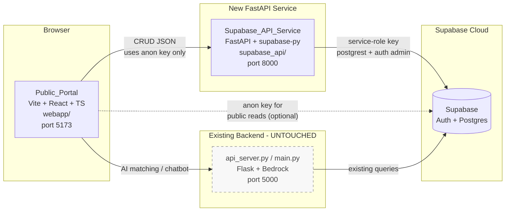
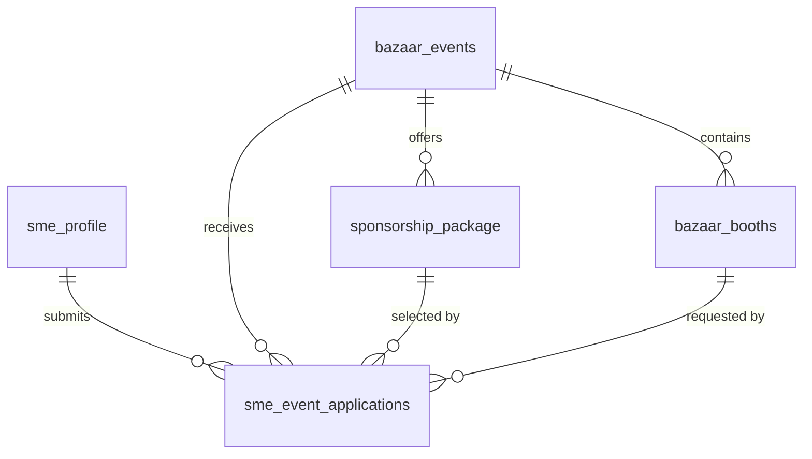
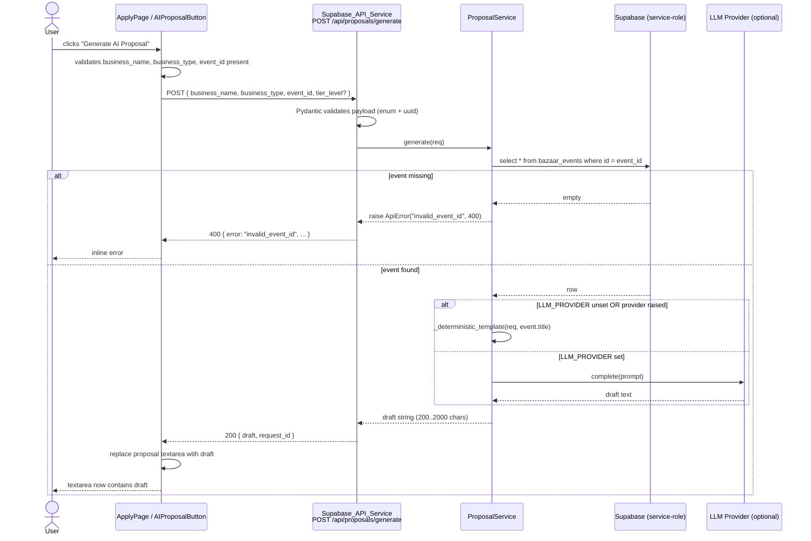
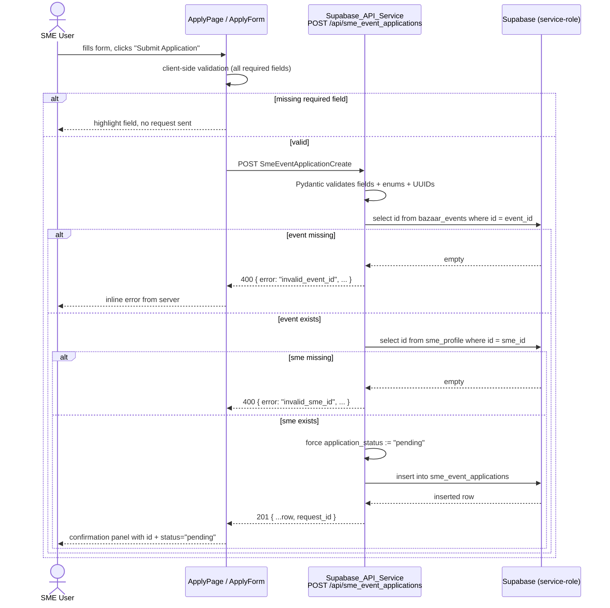

# Design Document

## Overview

The Public Vendor Portal is a self-contained addition to the AmbatuwinCendikiawan platform. It introduces two new code modules without touching the existing Flask AI backend:

1. `webapp/` — a Vite + React 18 + TypeScript single-page application that renders the public marketing site (`/`) and the vendor application form (`/apply`), styled to match the Google Skills visual language documented in the requirements.
2. `supabase_api/` — a FastAPI service that wraps `supabase-py` to expose JSON CRUD endpoints for the five domain tables (`sme_profile`, `bazaar_events`, `sponsorship_package`, `bazaar_booths`, `sme_event_applications`), Supabase Auth flows, an AI proposal endpoint, and a health check.

The existing backend (`api_server.py`, `database_service.py`, `llm_service.py`, `event_matcher.py`, `main.py`, `config.py`) continues to serve the AI matching and chatbot endpoints on port `5000` and is treated as read-only by this feature. The new portal calls the new FastAPI service for CRUD operations and continues to call the existing backend for AI matching and chatbot operations.

### Design Goals

- **Isolation**: zero edits to the existing backend; the new service runs on a different port and lives in a new directory tree.
- **Predictability**: a single error envelope, deterministic enum validation, and uniform request correlation IDs across every endpoint.
- **Out-of-the-box correctness**: the AI proposal endpoint always works locally because it falls back to a deterministic template when no LLM provider is configured.
- **Visual fidelity**: a single design-token file is the source of truth for the Google Skills look; components consume tokens, never hard-coded values.

### Tradeoffs Recorded Inline

- **No GraphQL / no tRPC.** Plain REST + JSON keeps the contract documentable in this file and trivial to test from the browser. Cost: more route boilerplate.
- **No ORM layer.** `supabase-py` is used directly because the schema lives in Supabase and we want the FastAPI service to be a thin adapter rather than a parallel data model. Cost: enum validation must be explicit in Pydantic instead of inherited from a model class.
- **Service-role key on the backend, anon key on the frontend.** This matches how Supabase expects keys to be used; Public_Portal never sees the service role key, and the FastAPI service only emits the service-role key in outbound Supabase calls.
- **AI fallback over feature gating.** Rather than disabling the AI proposal button when no LLM is configured, the backend returns a deterministic template. Cost: drafts are less varied without an LLM, but the user experience is uniform.

## Architecture

### System Architecture Diagram



### Key Distribution

| Process | Reads `supabaseUrl` | Reads `supabaseAnonPublic` / `REACT_APP_SUPABASE_ANON_KEY` | Reads `supabaseSecret` (fallback `supabaseKey`) |
| --- | --- | --- | --- |
| Public_Portal (browser, port 5173) | Yes (build-time `REACT_APP_SUPABASE_URL`) | Yes (build-time) | **Never** |
| Supabase_API_Service (port 8000) | Yes (runtime) | Yes (runtime, used for `auth.signUp` / `signInWithPassword`) | Yes (runtime, used for table CRUD via service-role) |
| Existing_Backend (port 5000) | Yes (runtime, unchanged) | n/a | Uses existing key wiring; not modified |

The frontend never receives or transports the service-role key. The FastAPI service treats the service-role key as a hard secret: it is loaded once at startup, stored on the app state, and never serialized into a response body or log line (see Requirement 2.8 and the Error Handling section).

### Process Layout

```
repo-root/
├── api_server.py           # untouched
├── database_service.py     # untouched
├── llm_service.py          # untouched
├── event_matcher.py        # untouched
├── main.py                 # untouched
├── config.py               # untouched
├── webapp/                 # NEW (Vite + React + TS)
│   ├── public/assets/
│   ├── src/
│   ├── index.html
│   └── package.json
└── supabase_api/           # NEW (FastAPI + supabase-py)
    ├── app/
    ├── tests/
    └── pyproject.toml
```

### Request Flow Summary

1. The browser loads the SPA from `http://localhost:5173`.
2. Component code calls `apiClient.get('/api/bazaar_events')` → `http://localhost:8000/api/bazaar_events`.
3. FastAPI parses the request, runs Pydantic validation, calls Supabase via the service-role client, and returns a JSON response wrapped in the standard envelope.
4. Auth flows (`/api/auth/login`, `/api/auth/register`, `/api/auth/logout`) use the **anon** Supabase client because Supabase Auth is designed to be called with the anon key plus the user's password.
5. CRUD flows use the **service-role** Supabase client because the FastAPI service is the trusted server-side caller.
6. Errors are normalized by a single FastAPI exception handler into `{error, message, request_id}`.

## Components and Interfaces

### Frontend (`webapp/`)

#### Routes

| Path | Component | Layout |
| --- | --- | --- |
| `/` | `HomePage` | `SharedLayout` |
| `/apply` | `ApplyPage` | `SharedLayout` |
| `*` (fallback) | `NotFoundPage` | `SharedLayout` |

Routing uses `react-router-dom@6`. `/` renders Hero → About → How It Works → Who It's For → Featured Events → Dark Feature Section → Footer. `/apply` renders Hero (smaller) → ApplyForm → AIProposalButton → submission feedback panel.

#### Shared_Layout Components

```
SharedLayout
├── TopHeader
│   ├── Logo (links to /)
│   ├── HeaderSearch (pill input)
│   ├── SignInLink     ─→ opens AuthModal in "signin" mode
│   └── JoinButton     ─→ opens AuthModal in "register" mode
├── SidebarNav
│   └── NavItem × 5    (Home, Events, Apply, Profile, Applications)
├── <main>{children}</main>
└── Footer (Home, Events, Apply, Privacy, Contact)
```

`SidebarNav` collapses into a top-anchored hamburger menu when `window.matchMedia('(max-width: 767px)').matches`. Active state is derived from `useLocation().pathname`.

#### Page-level Components

| Component | Used by | Responsibility |
| --- | --- | --- |
| `HeroSection` | HomePage, ApplyPage | Headline, subheadline, pill search, decorative blob illustrations |
| `AboutSection` | HomePage | Plain-language explanation of the platform |
| `HowItWorks` | HomePage | Three-step grid with icons |
| `WhoItsFor` | HomePage | Two columns: SMEs and Event Organizers |
| `FeaturedEventsGrid` | HomePage | Calls `GET /api/bazaar_events`, renders up to 6 `EventCard`s |
| `EventCard` | FeaturedEventsGrid | Single event card with category chip, tier chip, title, description, duration row, circular arrow CTA |
| `DarkFeatureSection` | HomePage | Dark-themed panel with at least four pill-shaped category filter chips |
| `ApplyForm` | ApplyPage | Renders all input fields, owns form state, validates locally, POSTs to `/api/sme_event_applications` |
| `AIProposalButton` | ApplyPage (inside ApplyForm) | POSTs to `/api/proposals/generate`, replaces proposal textarea on success |
| `AuthModal` | TopHeader | Two modes (`signin`, `register`); submits to `/api/auth/login` or `/api/auth/register` |

#### Frontend Utilities

- `src/lib/apiClient.ts` — thin wrapper around `fetch` that prefixes the configured API base URL, attaches the access token from local storage when present, and parses the standard error envelope.
- `src/lib/env.ts` — reads `import.meta.env.VITE_SUPABASE_URL`, `VITE_SUPABASE_ANON_KEY`, and `VITE_API_BASE_URL`. (Vite exposes env vars prefixed with `VITE_`; the `REACT_APP_*` names from `.env` are aliased here at build time via a small Vite plugin or a documented `.env.local` mapping.)
- `src/lib/auth.ts` — token storage helpers (`localStorage`); subscribes the apiClient to token changes.
- `src/lib/enums.ts` — TypeScript string-literal unions mirroring the four Postgres enums; single source of truth for dropdown options.

#### Design Tokens

A single file at `src/styles/tokens.css` (and a parallel `src/styles/tokens.ts` exporting the same values for JS consumers) is the source of truth for colors, typography, spacing, radii, and shadows. See "Visual Design Tokens" below for the full list. Components must consume tokens via CSS custom properties (`var(--color-primary)`) or the typed `tokens` object; literal hex values and pixel sizes outside of `tokens.css` are forbidden.

#### Asset Organization

```
webapp/public/assets/
├── logo.svg
├── favicon.ico
├── og/
│   ├── og-home.png
│   └── og-apply.png
├── hero/
│   ├── hero-blob-blue-yellow.svg
│   ├── hero-blob-red-heart.svg
│   ├── hero-blob-purple-star.svg
│   ├── hero-blob-green-semicircle.svg
│   ├── hero-blob-pink-star.svg
│   └── hero-illustration-marketplace.svg
├── howitworks/
│   ├── howitworks-step-1.svg
│   ├── howitworks-step-2.svg
│   └── howitworks-step-3.svg
├── audience/
│   ├── audience-sme.svg
│   └── audience-organizer.svg
├── card/
│   ├── event-card-placeholder-1.jpg
│   ├── event-card-placeholder-2.jpg
│   ├── event-card-placeholder-3.jpg
│   ├── event-card-arrow-cta.svg
│   └── card-icon-clock.svg
├── dark/
│   └── dark-section-bg-blob.svg
├── apply/
│   ├── apply-decorative-blob-left.svg
│   ├── apply-decorative-blob-right.svg
│   └── ai-proposal-icon.svg
├── sidebar/
│   ├── sidebar-icon-home.svg
│   ├── sidebar-icon-events.svg
│   ├── sidebar-icon-apply.svg
│   ├── sidebar-icon-profile.svg
│   └── sidebar-icon-applications.svg
└── header/
    └── header-icon-search.svg
```

This layout maps 1:1 to Appendix A of the requirements; logical names match the file names.

### Backend (`supabase_api/`)

#### Module Layout

```
supabase_api/
├── app/
│   ├── __init__.py
│   ├── main.py                  # FastAPI app entrypoint, CORS, middleware, router includes
│   ├── settings.py              # Pydantic BaseSettings: env loader + validation
│   ├── supabase_client.py       # Factory: anon client + service-role client
│   ├── middleware/
│   │   ├── __init__.py
│   │   └── request_id.py        # Adds X-Request-Id, attaches to request.state
│   ├── errors.py                # ApiError, error envelope, exception handlers
│   ├── routers/
│   │   ├── __init__.py
│   │   ├── auth.py              # /api/auth/{register,login,logout}
│   │   ├── sme_profiles.py      # /api/sme_profiles
│   │   ├── bazaar_events.py     # /api/bazaar_events
│   │   ├── sponsorship_packages.py # /api/sponsorship_packages
│   │   ├── bazaar_booths.py     # /api/bazaar_booths
│   │   ├── sme_event_applications.py # /api/sme_event_applications
│   │   ├── proposals.py         # /api/proposals/generate
│   │   └── health.py            # /api/health
│   ├── schemas/
│   │   ├── __init__.py
│   │   ├── enums.py             # Python Enum mirrors of all four Postgres enums
│   │   ├── sme_profile.py
│   │   ├── bazaar_event.py
│   │   ├── sponsorship_package.py
│   │   ├── bazaar_booth.py
│   │   ├── sme_event_application.py
│   │   ├── auth.py
│   │   └── proposal.py
│   ├── services/
│   │   ├── __init__.py
│   │   └── ai_proposal.py       # LLM provider wrapper + deterministic fallback
│   └── logging_config.py        # JSON logger; redacts password and key fields
├── tests/
│   ├── unit/
│   ├── contract/
│   ├── property/                # Hypothesis tests
│   └── smoke/
├── pyproject.toml
└── README.md
```

#### App Entrypoint (`app/main.py`)

Responsibilities, in order at startup:

1. Construct `Settings` (which raises and exits with non-zero status if any required env var is missing — see Requirement 2.7).
2. Build the anon and service-role Supabase clients via `supabase_client.factory`.
3. Create the FastAPI app, attach `RequestIdMiddleware`, attach `CORSMiddleware` configured from `Settings.cors_allowed_origins`.
4. Register routers under the `/api` prefix.
5. Register exception handlers for `ApiError`, `RequestValidationError`, `JSONDecodeError`, and the catch-all `Exception`.

#### Settings / Env Loader (`app/settings.py`)

`Settings` is a `pydantic.BaseSettings` subclass with the following fields:

| Field | Env var | Default | Required |
| --- | --- | --- | --- |
| `supabase_url` | `supabaseUrl` | — | Yes |
| `supabase_service_key` | `supabaseSecret` | falls back to `supabaseKey` | Yes (one of the two) |
| `supabase_anon_key` | `supabaseAnonPublic` | — | Yes |
| `cors_allowed_origins` | `CORS_ALLOWED_ORIGINS` | `http://localhost:5173,http://localhost:3000` | No |
| `port` | `SUPABASE_API_PORT` | `8000` | No |
| `llm_provider` | `LLM_PROVIDER` | unset (triggers deterministic fallback) | No |
| `llm_api_key` | `LLM_API_KEY` | unset | No |

`Settings.__init__` validates that at least one of `supabaseSecret` or `supabaseKey` is set (Requirement 2.4). Missing required vars cause `sys.exit(1)` with a log line naming the variable.

#### Supabase Client Factory (`app/supabase_client.py`)

```python
def make_anon_client(settings: Settings) -> Client: ...
def make_service_client(settings: Settings) -> Client: ...
```

Both return `supabase.Client` instances. They are cached on `app.state.supabase_anon` and `app.state.supabase_service` and accessed inside routers via FastAPI dependencies (`Depends(get_anon_client)` / `Depends(get_service_client)`).

#### Routers

Each router is a separate `APIRouter` with prefix `/api/<resource>` and tags matching the resource name. Routers depend on the appropriate Supabase client and the request-scoped `request_id`. See "API Contract" for the full endpoint inventory.

#### Schemas / Pydantic Models

For each domain table there is a triple of models:

- `<Resource>Base` — fields shared by create and read.
- `<Resource>Create` — request body for `POST`; omits server-generated fields like `id`, `created_at`.
- `<Resource>Update` — request body for `PATCH`; all fields optional.
- `<Resource>Read` — response shape; includes `id` and timestamps.

Enum fields use the Python `Enum` classes from `schemas/enums.py`, which guarantees that any non-enum value triggers a Pydantic `ValueError` during request parsing — that is the single mechanism that satisfies all enum-validation acceptance criteria (Requirements 9.6, 11.6, 12.6, 13.7).

#### Error Handler + Request ID Middleware

`RequestIdMiddleware` reads the `X-Request-Id` header if present (and well-formed, ≥ 8 chars), otherwise generates a new UUID4 hex. The id is stored on `request.state.request_id`, attached to the response header, and included in every error envelope. The exception handlers translate framework errors into the standard envelope (see "Error Handling Strategy").

#### CORS Config

`CORSMiddleware` is configured with:

- `allow_origins` = parsed list from `Settings.cors_allowed_origins`
- `allow_methods` = `["GET", "POST", "PATCH", "DELETE", "OPTIONS"]`
- `allow_headers` = `["Content-Type", "Authorization", "X-Request-Id"]`
- `allow_credentials` = `True`

#### AI Proposal Service (`services/ai_proposal.py`)

```python
class ProposalRequest:
    business_name: str
    business_type: BusinessTypeEnum
    event_id: UUID
    tier_level: TierLevelEnum | None

class ProposalService:
    def __init__(self, supabase_service: Client, settings: Settings): ...
    async def generate(self, req: ProposalRequest) -> str: ...
    def _deterministic_template(self, req: ProposalRequest, event_title: str) -> str: ...
```

`generate` first fetches the `bazaar_events` row matching `req.event_id`. If the row is absent, it raises `ApiError("invalid_event_id", 400)`. If `settings.llm_provider` is unset, it returns the result of `_deterministic_template`. Otherwise it calls the configured provider and falls back to `_deterministic_template` on any provider exception. Both paths return a string of at least 200 and at most 2000 characters; the deterministic template is sized by construction to land in that range for any input.

The deterministic template is pure text interpolation, has no network calls, and is thus trivially testable and exhibits stable output for identical inputs — this is what the smoke test will assert.

## Data Models

The data models below mirror the Supabase schema described in `Amba.txt` and referenced by the requirements. UUID primary keys are generated by Postgres (`gen_random_uuid()`); timestamps are `timestamptz` and are server-set on insert/update. Column-level `NOT NULL` constraints listed below drive the Pydantic `*Create` models — every NOT NULL column appears as a required field on the create schema, which in turn drives the missing-required-field validation property.

### Enums (mirrored in `schemas/enums.py`)

```python
class ApplicationStatusEnum(str, Enum):
    PENDING    = "pending"
    APPROVED   = "approved"
    REJECTED   = "rejected"
    WITHDRAWN  = "withdrawn"

class BookingStatusEnum(str, Enum):
    AVAILABLE  = "available"
    RESERVED   = "reserved"
    BOOKED     = "booked"
    CANCELLED  = "cancelled"

class TierLevelEnum(str, Enum):
    BRONZE     = "bronze"
    SILVER     = "silver"
    GOLD       = "gold"
    PLATINUM   = "platinum"

class BusinessTypeEnum(str, Enum):
    FOOD_BEVERAGE = "food_beverage"
    FASHION       = "fashion"
    CRAFTS        = "crafts"
    SERVICES      = "services"
    OTHER         = "other"
```

### Table: `sme_profile`

| Column | Type | Nullability | Notes |
| --- | --- | --- | --- |
| `id` | `uuid` | NOT NULL, PK | server-generated |
| `user_id` | `uuid` | NOT NULL | FK → `auth.users.id` |
| `business_name` | `text` | NOT NULL | ≤ 255 chars |
| `business_type` | `business_type_enum` | NOT NULL | enum |
| `contact_email` | `text` | NOT NULL | RFC-5322-ish |
| `contact_phone` | `text` | NULL | |
| `description` | `text` | NULL | |
| `created_at` | `timestamptz` | NOT NULL | default `now()` |
| `updated_at` | `timestamptz` | NOT NULL | default `now()` |

### Table: `bazaar_events`

| Column | Type | Nullability | Notes |
| --- | --- | --- | --- |
| `id` | `uuid` | NOT NULL, PK | server-generated |
| `title` | `text` | NOT NULL | |
| `description` | `text` | NULL | |
| `location` | `text` | NOT NULL | |
| `start_date` | `timestamptz` | NOT NULL | |
| `end_date` | `timestamptz` | NOT NULL | must be ≥ `start_date` |
| `capacity` | `int` | NULL | optional total booth count |
| `image_url` | `text` | NULL | |
| `created_at` | `timestamptz` | NOT NULL | default `now()` |
| `updated_at` | `timestamptz` | NOT NULL | default `now()` |

### Table: `sponsorship_package`

| Column | Type | Nullability | Notes |
| --- | --- | --- | --- |
| `id` | `uuid` | NOT NULL, PK | server-generated |
| `event_id` | `uuid` | NOT NULL | FK → `bazaar_events.id` |
| `tier_level` | `tier_level_enum` | NOT NULL | enum |
| `name` | `text` | NOT NULL | |
| `price` | `numeric` | NOT NULL | ≥ 0 |
| `benefits` | `text` | NULL | |
| `slots_total` | `int` | NULL | |
| `slots_remaining` | `int` | NULL | |
| `created_at` | `timestamptz` | NOT NULL | default `now()` |

### Table: `bazaar_booths`

| Column | Type | Nullability | Notes |
| --- | --- | --- | --- |
| `id` | `uuid` | NOT NULL, PK | server-generated |
| `event_id` | `uuid` | NOT NULL | FK → `bazaar_events.id` |
| `booth_number` | `text` | NOT NULL | unique per `event_id` |
| `location_label` | `text` | NULL | e.g. "Hall A, row 2" |
| `size_sqm` | `numeric` | NULL | |
| `price` | `numeric` | NULL | |
| `booking_status` | `booking_status_enum` | NOT NULL | default `available` |
| `created_at` | `timestamptz` | NOT NULL | default `now()` |

### Table: `sme_event_applications`

| Column | Type | Nullability | Notes |
| --- | --- | --- | --- |
| `id` | `uuid` | NOT NULL, PK | server-generated |
| `sme_id` | `uuid` | NOT NULL | FK → `sme_profile.id` |
| `event_id` | `uuid` | NOT NULL | FK → `bazaar_events.id` |
| `sponsorship_package_id` | `uuid` | NULL | FK → `sponsorship_package.id` |
| `booth_id` | `uuid` | NULL | FK → `bazaar_booths.id` |
| `proposal` | `text` | NULL | 0–5000 chars |
| `application_status` | `application_status_enum` | NOT NULL | default `pending`; create endpoint forces `pending` per Req 13.6 |
| `created_at` | `timestamptz` | NOT NULL | default `now()` |
| `updated_at` | `timestamptz` | NOT NULL | default `now()` |

### Foreign Key Relationship Diagram



## API Contract

All endpoints share these conventions:

- Base URL: `http://localhost:8000` in dev.
- Request bodies: `application/json`.
- Successful responses include the resource payload merged with `request_id`.
- Error responses match the standard envelope `{ "error": "<code>", "message": "<human>", "request_id": "<id>" }`.
- 401 responses on protected endpoints include `WWW-Authenticate: Bearer`.

### Auth (`routers/auth.py`)

| Method | Path | Request body | Success response | Errors |
| --- | --- | --- | --- | --- |
| POST | `/api/auth/register` | `{ email: string, password: string, display_name: string }` | `200 { user_id: uuid, access_token: string, request_id }` | `400 missing_field`, `400 invalid_email`, `409 user_exists`, `502 supabase_unreachable` |
| POST | `/api/auth/login` | `{ email: string, password: string }` | `200 { access_token: string, refresh_token: string, request_id }` | `400 missing_field`, `401 invalid_credentials`, `502 supabase_unreachable` |
| POST | `/api/auth/logout` | `{ access_token: string }` | `200 { ok: true, request_id }` | `400 missing_field`, `401 invalid_token`, `502 supabase_unreachable` |

Passwords are accepted only via the JSON body, never via query string, and are excluded from the structured logger by a redaction filter (Requirement 8.8).

### SME Profiles (`routers/sme_profiles.py`)

| Method | Path | Request body | Success response | Errors |
| --- | --- | --- | --- | --- |
| POST | `/api/sme_profiles` | `SmeProfileCreate` | `201 SmeProfileRead` | `400 missing_field`, `400 invalid_business_type`, `502 supabase_unreachable` |
| GET | `/api/sme_profiles` | — | `200 { items: SmeProfileRead[], request_id }` | `502 supabase_unreachable` |
| GET | `/api/sme_profiles/{id}` | — | `200 SmeProfileRead` | `404 not_found`, `502 supabase_unreachable` |
| PATCH | `/api/sme_profiles/{id}` | `SmeProfileUpdate` | `200 SmeProfileRead` | `400 invalid_business_type`, `404 not_found`, `502 supabase_unreachable` |
| DELETE | `/api/sme_profiles/{id}` | — | `200 { ok: true, request_id }` | `404 not_found`, `502 supabase_unreachable` |

### Bazaar Events (`routers/bazaar_events.py`)

| Method | Path | Request body | Success response | Errors |
| --- | --- | --- | --- | --- |
| POST | `/api/bazaar_events` | `BazaarEventCreate` | `201 BazaarEventRead` | `400 missing_field`, `400 invalid_date_range`, `502 supabase_unreachable` |
| GET | `/api/bazaar_events` | — | `200 { items: BazaarEventRead[], request_id }` | `502 supabase_unreachable` |
| GET | `/api/bazaar_events/{id}` | — | `200 BazaarEventRead` | `404 not_found`, `502 supabase_unreachable` |
| PATCH | `/api/bazaar_events/{id}` | `BazaarEventUpdate` | `200 BazaarEventRead` | `400 invalid_date_range`, `404 not_found`, `502 supabase_unreachable` |
| DELETE | `/api/bazaar_events/{id}` | — | `200 { ok: true, request_id }` | `404 not_found`, `502 supabase_unreachable` |

### Sponsorship Packages (`routers/sponsorship_packages.py`)

| Method | Path | Request body | Success response | Errors |
| --- | --- | --- | --- | --- |
| POST | `/api/sponsorship_packages` | `SponsorshipPackageCreate` | `201 SponsorshipPackageRead` | `400 missing_field`, `400 invalid_tier_level`, `400 invalid_event_id`, `502 supabase_unreachable` |
| GET | `/api/sponsorship_packages` | — | `200 { items: SponsorshipPackageRead[], request_id }` | `502 supabase_unreachable` |
| GET | `/api/sponsorship_packages?event_id={uuid}` | — | `200 { items: SponsorshipPackageRead[], request_id }` | `502 supabase_unreachable` |
| PATCH | `/api/sponsorship_packages/{id}` | `SponsorshipPackageUpdate` | `200 SponsorshipPackageRead` | `400 invalid_tier_level`, `404 not_found`, `502 supabase_unreachable` |
| DELETE | `/api/sponsorship_packages/{id}` | — | `200 { ok: true, request_id }` | `404 not_found`, `502 supabase_unreachable` |

### Bazaar Booths (`routers/bazaar_booths.py`)

| Method | Path | Request body | Success response | Errors |
| --- | --- | --- | --- | --- |
| POST | `/api/bazaar_booths` | `BazaarBoothCreate` | `201 BazaarBoothRead` | `400 missing_field`, `400 invalid_booking_status`, `400 invalid_event_id`, `502 supabase_unreachable` |
| GET | `/api/bazaar_booths` | — | `200 { items: BazaarBoothRead[], request_id }` | `502 supabase_unreachable` |
| GET | `/api/bazaar_booths?event_id={uuid}` | — | `200 { items: BazaarBoothRead[], request_id }` | `502 supabase_unreachable` |
| PATCH | `/api/bazaar_booths/{id}` | `BazaarBoothUpdate` | `200 BazaarBoothRead` | `400 invalid_booking_status`, `404 not_found`, `502 supabase_unreachable` |
| DELETE | `/api/bazaar_booths/{id}` | — | `200 { ok: true, request_id }` | `404 not_found`, `502 supabase_unreachable` |

### SME Event Applications (`routers/sme_event_applications.py`)

| Method | Path | Request body | Success response | Errors |
| --- | --- | --- | --- | --- |
| POST | `/api/sme_event_applications` | `SmeEventApplicationCreate` | `201 SmeEventApplicationRead` | `400 missing_field`, `400 invalid_event_id`, `400 invalid_sme_id`, `502 supabase_unreachable` |
| GET | `/api/sme_event_applications` | — | `200 { items: SmeEventApplicationRead[], request_id }` | `502 supabase_unreachable` |
| GET | `/api/sme_event_applications?sme_id={uuid}` | — | `200 { items: SmeEventApplicationRead[], request_id }` | `502 supabase_unreachable` |
| PATCH | `/api/sme_event_applications/{id}` | `SmeEventApplicationUpdate` | `200 SmeEventApplicationRead` | `400 invalid_application_status`, `404 not_found`, `502 supabase_unreachable` |
| DELETE | `/api/sme_event_applications/{id}` | — | `200 { ok: true, request_id }` | `404 not_found`, `502 supabase_unreachable` |

The POST handler always overwrites any client-supplied `application_status` with `pending` (Requirement 13.6).

### Proposals (`routers/proposals.py`)

| Method | Path | Request body | Success response | Errors |
| --- | --- | --- | --- | --- |
| POST | `/api/proposals/generate` | `{ business_name: string, business_type: BusinessTypeEnum, event_id: uuid, tier_level?: TierLevelEnum }` | `200 { draft: string (200..2000 chars), request_id }` | `400 missing_field`, `400 invalid_business_type`, `400 invalid_tier_level`, `400 invalid_event_id`, `502 supabase_unreachable` |

### Health (`routers/health.py`)

| Method | Path | Success response |
| --- | --- | --- |
| GET | `/api/health` | `200 { status: "healthy", supabase: "connected" \| "disconnected", request_id }` |

The handler issues a single read against `bazaar_events LIMIT 1`. Connection failures return `supabase: "disconnected"` but still 200 status — the endpoint advertises liveness, not Supabase health (Requirement 16).

## Sequence Diagrams

### (a) AI Proposal Generation



### (b) SME Application Submission



### (c) Auth Login

```mermaid
sequenceDiagram
    actor U as User
    participant FE as TopHeader / AuthModal
    participant API as Supabase_API_Service<br/>POST /api/auth/login
    participant SB as Supabase Auth (anon client)

    U->>FE: enters email + password, submits
    FE->>API: POST { email, password }
    API->>API: Pydantic validates non-empty email + password
    alt missing field
        API-->>FE: 400 { error: "missing_field", message: "<field>", ... }
        FE-->>U: inline error
    else valid
        API->>SB: auth.sign_in_with_password({email, password})
        alt invalid creds
            SB-->>API: AuthApiError
            API-->>FE: 401 { error: "invalid_credentials", ... }
            FE-->>U: inline error (generic)
        else success
            SB-->>API: { session: { access_token, refresh_token } }
            API-->>FE: 200 { access_token, refresh_token, request_id }
            FE->>FE: store tokens in localStorage; close modal
            FE-->>U: header now shows authenticated state
        end
    end
    Note over API: Password is never logged. The structured logger<br/>filters fields named "password", "supabaseSecret",<br/>"supabaseKey", "service_key", "access_token".
```


## Correctness Properties

*A property is a characteristic or behavior that should hold true across all valid executions of a system — essentially, a formal statement about what the software is supposed to do. Properties serve as the bridge between the human-readable acceptance criteria above and machine-verifiable correctness guarantees we can run as automated tests.*

The Public Vendor Portal is a good fit for property-based testing because the FastAPI service exposes pure-by-design CRUD over typed payloads (parsing, validation, enum/FK rejection, error envelope shaping), and the deterministic AI proposal fallback is a pure string transformation. UI rendering is mostly example-based, but a small number of universal UI invariants (event grid sizing, sidebar active state, dropdown enum mapping, design-token compliance) are also expressed below as properties.

The acceptance criteria in `requirements.md` were classified using the prework tool. Many criteria share identical structure across resources (enum rejection, FK rejection, required-field omission, 404-on-missing). The reflection step consolidated those repeats so that each property below provides unique validation value.

### Property 1: Enum field rejection

*For any* domain resource `R` with an enum-typed field `F`, and *for any* string `S` that is not a member of the Postgres enum bound to `F`, a create or update request to `R` whose payload sets `F = S` SHALL return HTTP 400 with `error` matching the documented invalid-enum code for that field (`invalid_business_type`, `invalid_tier_level`, `invalid_booking_status`, `invalid_application_status`).

**Validates: Requirements 9.6, 11.6, 12.6, 13.7**

### Property 2: Foreign-key rejection on create

*For any* domain resource `R` with a non-null foreign-key field `F` referencing table `T`, and *for any* UUID `U` not present in `T`, a create request to `R` with `F = U` SHALL return HTTP 400 with `error = invalid_<field>_id` and SHALL NOT insert any row in the underlying table.

**Validates: Requirements 11.7, 14.5**

This single property also covers the FK validation for `sme_event_applications.event_id`, `sme_event_applications.sme_id`, `bazaar_booths.event_id`, and `sponsorship_package.event_id` since the rejection shape is identical across all four.

### Property 3: Missing required-field rejection on create

*For any* domain resource `R` with required-field set `Req(R)` derived from the NOT NULL columns of its Supabase table, and *for any* non-empty subset `S ⊆ Req(R)` that is omitted from a create payload, the create endpoint SHALL return HTTP 400 with `error = missing_field` and `message` mentioning at least one field name in `S`, and SHALL NOT insert any row.

**Validates: Requirements 8.6, 10.6, 14.4**

This property also covers the implicit required-field checks on every other create endpoint (`sme_profile`, `sponsorship_package`, `bazaar_booths`, `sme_event_applications`).

### Property 4: Application status forced to `pending` on create

*For any* create payload submitted to `POST /api/sme_event_applications` (whether or not the payload includes an explicit `application_status`), the persisted row SHALL have `application_status = "pending"`.

**Validates: Requirements 13.6**

### Property 5: Proposal field is preserved on create

*For any* string `P` with `1 ≤ len(P) ≤ 5000`, a create payload submitted to `POST /api/sme_event_applications` whose `proposal` field equals `P` SHALL result in an insert call where the persisted `proposal` column equals `P` byte-for-byte.

**Validates: Requirements 13.8**

### Property 6: Deterministic AI proposal fallback

*For any* valid input `(business_name, business_type, event_id)` referencing an existing `bazaar_events` row with title `T`, when no LLM provider is configured, two successive calls to `POST /api/proposals/generate` with identical inputs SHALL return identical `draft` strings, and that string SHALL satisfy all of:
1. `200 ≤ len(draft) ≤ 2000`,
2. `business_name` appears as a substring of `draft`,
3. `business_type.value` appears as a substring of `draft`,
4. `T` appears as a substring of `draft`.

**Validates: Requirements 14.3, 14.7**

### Property 7: Service-role key fallback precedence

*For any* environment in which exactly one of `supabaseSecret` or `supabaseKey` is set to a non-empty value `V`, the resolved `Settings.supabase_service_key` SHALL equal `V`. *For any* environment in which both are set to non-empty values, `Settings.supabase_service_key` SHALL equal the value of `supabaseSecret` (precedence). *For any* environment in which neither is set, construction of `Settings` SHALL exit non-zero.

**Validates: Requirements 2.4**

### Property 8: Required env-var presence and naming

*For any* non-empty subset `M` of the required env-var set `{supabaseUrl, (supabaseSecret OR supabaseKey), supabaseAnonPublic}` that is missing at startup, constructing `Settings` SHALL exit with a non-zero status code, and the captured stderr/log output SHALL contain the name of every variable in `M`.

**Validates: Requirements 2.7**

### Property 9: Standard response envelope

*For any* HTTP response produced by any endpoint of Supabase_API_Service, the response body SHALL be a JSON object containing a `request_id` string of length ≥ 8. *For any* successful response, the `Content-Type` header SHALL be `application/json`. *For any* error response (status ≥ 400), the body SHALL also contain string fields `error` and `message`.

**Validates: Requirements 15.1, 15.2, 15.5**

### Property 10: Secrets never leak

*For any* request to any Supabase_API_Service endpoint with a password value `P` (when applicable to the endpoint) under a configured service key `K`, neither `P` nor `K` SHALL appear as a substring of the response body, any response header value, or any log line emitted while handling the request.

**Validates: Requirements 2.8, 8.8**

### Property 11: 404 on missing resource for GET/PATCH/DELETE

*For any* domain resource `R` with primary-key universe `K(R)` and a Supabase state in which key `k ∉ K(R)`, requests `GET /api/R/{k}`, `PATCH /api/R/{k}`, and `DELETE /api/R/{k}` SHALL return HTTP 404 with `error = not_found`.

**Validates: Requirements 9.7**

The same property shape applies to `bazaar_events`, `sponsorship_packages`, `bazaar_booths`, and `sme_event_applications`, parametrized over the resource set.

### Property 12: UI dropdown options equal enum membership

*For any* form dropdown bound to a Postgres enum (the `business_type` and `tier_level` dropdowns on Apply_As_Vendor_Page), the rendered set of option values SHALL equal the set of enum members exactly — every enum member appears as an option, and every option is a member of the enum.

**Validates: Requirements 4.3, 4.4**

### Property 13: Featured Events grid sizing

*For any* list `L` of bazaar events returned by `GET /api/bazaar_events` with `len(L) = k`, FeaturedEventsGrid SHALL render exactly `min(k, 6)` `EventCard` elements and SHALL NOT render any empty placeholder cards.

**Validates: Requirements 3.9**

### Property 14: Sidebar active state matches current route

*For any* nav entry `E` in Sidebar_Nav and *for any* current route equal to `E.path`, the rendered Sidebar_Nav SHALL mark `E` as active and SHALL mark every other entry as inactive.

**Validates: Requirements 6.6**

### Property 15: Submit-gating on missing required fields

*For any* form on Public_Portal with required-field set `Req` (Apply_As_Vendor_Page submit and AI_Proposal_Button click), and *for any* non-empty subset `S ⊆ Req` whose values are empty when the user clicks submit/generate, the form SHALL render an inline error for every field in `S` and SHALL NOT issue a network request.

**Validates: Requirements 4.8, 5.7**

### Property 16: Proposal textarea accepts up to 5000 characters

*For any* string `S`, the proposal textarea on Apply_As_Vendor_Page SHALL accept `S` if and only if `len(S) ≤ 5000`.

**Validates: Requirements 4.6**

### Property 17: AI draft insertion / preservation invariants

*For any* current proposal-textarea value `V` and any response from `POST /api/proposals/generate`:
1. If the response is a 2xx with body `{ draft: D }`, the textarea value after the response SHALL equal `D` (regardless of `V`).
2. If the response is a 4xx or 5xx, the textarea value after the response SHALL equal `V` (the prior value is preserved exactly).

**Validates: Requirements 5.4, 5.6**

### Property 18: Supabase exception translation

*For any* exception `E` raised by a `supabase-py` client call during a request, Supabase_API_Service SHALL respond with HTTP 502 and `error = supabase_unreachable`, and SHALL emit a log record whose serialized form contains both `type(E).__name__` and `str(E)`.

**Validates: Requirements 15.4**

### Property 19: CORS allow-list compliance

*For any* configured `CORS_ALLOWED_ORIGINS` value parsed into the set `O`, and *for any* request `Origin` header value `r`, the response SHALL include `Access-Control-Allow-Origin: r` if and only if `r ∈ O`. (When `CORS_ALLOWED_ORIGINS` is unset, `O = { "http://localhost:5173", "http://localhost:3000" }`.)

**Validates: Requirements 17.2, 17.3**

### Property 20: Primary CTA visual invariants

*For any* element rendered with the primary-CTA pill button variant on Public_Portal, the computed `background-color` SHALL equal the design token `--color-primary` (Google blue `#1a73e8`), and the computed `border-radius` SHALL be at least half the rendered element's height.

**Validates: Requirements 7.2, 7.4**

## Error Handling

### Standard Error Envelope

Every error response from Supabase_API_Service uses the same JSON shape:

```json
{
  "error": "<machine-readable code, lowercase_snake>",
  "message": "<human-readable description>",
  "request_id": "<at least 8 chars, matches X-Request-Id header>"
}
```

Optional supplementary fields (e.g., `field`, `details`) MAY be added per-route, but the three core fields are always present.

### Error Code Catalog

| `error` | HTTP status | When raised |
| --- | --- | --- |
| `invalid_json` | 400 | Body cannot be parsed as JSON (Req 15.3) |
| `missing_field` | 400 | Required field absent on create payload or auth payload (Reqs 8.6, 10.6, 14.4) |
| `invalid_business_type` | 400 | `business_type` not in `business_type_enum` (Req 9.6) |
| `invalid_tier_level` | 400 | `tier_level` not in `tier_level_enum` (Req 11.6) |
| `invalid_booking_status` | 400 | `booking_status` not in `booking_status_enum` (Req 12.6) |
| `invalid_application_status` | 400 | `application_status` not in `application_status_enum` (Req 13.7) |
| `invalid_event_id` | 400 | FK to `bazaar_events` not found (Reqs 11.7, 14.5) |
| `invalid_sme_id` | 400 | FK to `sme_profile` not found |
| `invalid_date_range` | 400 | `end_date < start_date` on `bazaar_events` |
| `invalid_credentials` | 401 | Supabase Auth rejected sign-in (Req 8.7) |
| `invalid_token` | 401 | Logout called with missing/expired token |
| `not_found` | 404 | Path id does not match any row (Req 9.7 + analogues) |
| `user_exists` | 409 | Registration email already used |
| `supabase_unreachable` | 502 | Any `supabase-py` exception (Req 15.4) |
| `internal_error` | 500 | Catch-all for uncaught exceptions inside the FastAPI app (does not leak stack trace) |

### Exception-to-Envelope Mapping

```python
@app.exception_handler(ApiError)
async def api_error_handler(request, exc):
    return JSONResponse(
        status_code=exc.status_code,
        content={"error": exc.code, "message": exc.message,
                 "request_id": request.state.request_id},
    )

@app.exception_handler(RequestValidationError)
async def validation_handler(request, exc):
    # Map Pydantic errors into either missing_field or the
    # corresponding invalid_<enum> code based on the failing field.
    code, message = classify_validation_error(exc)
    return JSONResponse(
        status_code=400,
        content={"error": code, "message": message,
                 "request_id": request.state.request_id},
    )

@app.exception_handler(supabase.SupabaseException)
async def supabase_handler(request, exc):
    logger.error("supabase_error", exc_class=type(exc).__name__, exc_msg=str(exc),
                 request_id=request.state.request_id)
    return JSONResponse(
        status_code=502,
        content={"error": "supabase_unreachable",
                 "message": "Could not reach Supabase",
                 "request_id": request.state.request_id},
    )

@app.exception_handler(Exception)
async def fallback_handler(request, exc):
    logger.exception("unhandled", request_id=request.state.request_id)
    return JSONResponse(
        status_code=500,
        content={"error": "internal_error",
                 "message": "Unexpected server error",
                 "request_id": request.state.request_id},
    )
```

### Frontend Error Surfaces

`apiClient` parses every non-2xx response as the standard envelope. UI components display `message` directly to the user (it is by construction safe to display) and log `error` + `request_id` to the console for support correlation.

### Logging and Redaction

The structured logger is configured with a redaction filter that replaces the value of any key matching `password`, `passwd`, `secret`, `service_key`, `supabaseSecret`, `supabaseKey`, `access_token`, or `refresh_token` with the literal string `"***REDACTED***"` before serializing. Property 10 is the executable check that this filter is correctly wired.

## Testing Strategy

The dual testing approach combines example-based unit/contract tests for specific scenarios with property-based tests for universal invariants.

### Frontend Tests (`webapp/`)

- **Unit tests**: `vitest` + `@testing-library/react`. One test file per component covering:
  - Required field highlighting (Req 4.8, 5.7).
  - Loading state of `AIProposalButton` (Req 5.3).
  - Error message rendering on failed fetch (Req 4.10, 5.6).
  - `prefers-reduced-motion` behavior (Req 7.7).
- **Property tests** with `fast-check`:
  - Property 12 (dropdown enum equality), Property 13 (featured grid sizing), Property 14 (sidebar active state), Property 15 (submit gating subsets), Property 16 (textarea length), Property 17 (draft insertion / preservation), Property 20 (primary CTA visual invariants).
  - Each property test uses `fc.assert(prop, { numRuns: 100 })` and is tagged with the comment header `// Feature: public-vendor-portal, Property <N>: <text>`.
- **Visual regression**: a single `Playwright` snapshot test of `/` and `/apply` to catch token-level drift; not part of the property suite.

### Backend Tests (`supabase_api/tests/`)

- **Unit tests** (`pytest`):
  - Settings env loader: each required-var omission scenario (covers Property 8 baseline).
  - Error handler: every `ApiError` subclass renders the envelope correctly.
  - Logger redaction: each redacted key produces `***REDACTED***` in serialized output.
  - Deterministic-template generator: exact string equality for canonical inputs (smoke test for Property 6).
- **Contract tests** (`pytest` + `httpx.AsyncClient` + Supabase mocks):
  - One test per endpoint listed in "API Contract": valid request → expected status + body shape.
  - Each error code in the catalog has at least one example test.
- **Property tests** with `Hypothesis`:
  - Property 1 (enum rejection) — strategy: random non-enum strings × resource list; assert 400 + correct error code.
  - Property 2 (FK rejection) — strategy: random UUIDs disjoint from a fixed in-memory event/SME set; assert 400 + correct code; assert no insert call.
  - Property 3 (missing required-field) — strategy: subsets of required-field set per resource; assert 400 + `error = missing_field` + message names a missing field.
  - Property 4 (application_status forced pending) — strategy: random create payloads with arbitrary client-supplied `application_status`; intercept Supabase insert call; assert `application_status == "pending"`.
  - Property 5 (proposal preserved) — strategy: `text(min_size=1, max_size=5000)`; assert intercepted insert call carries the same string.
  - Property 6 (deterministic AI fallback) — strategy: random valid inputs; call twice; assert equality, length bounds, substring inclusion. Also serves as the **smoke test** for the deterministic fallback (single fixed input, exact expected text).
  - Property 7 (service-role key fallback) — strategy: random key values × precedence mode (`only_secret`, `only_key`, `both`); assert resolution.
  - Property 8 (required env-var presence) — strategy: power-set of required vars to drop; assert `SystemExit(1)` and stderr names every dropped var.
  - Property 9 (response envelope) — meta-property: across all routes, fuzz inputs, assert envelope invariants on every response.
  - Property 10 (secret leakage) — strategy: random sentinel password and sentinel service key; drive every endpoint with random valid/invalid payloads (mocking Supabase to echo input where applicable); assert sentinels never appear in response body, headers, or captured logs.
  - Property 11 (404 on missing) — strategy: random UUIDs disjoint from mocked DB; assert 404 + `not_found` for GET/PATCH/DELETE on every resource.
  - Property 18 (Supabase exception translation) — strategy: random exception classes/messages raised from mocked client; assert 502 + log content.
  - Property 19 (CORS allow-list) — strategy: random origin sets and request origins; assert allow-header behavior.
  - Each Hypothesis test is configured with `@settings(max_examples=100)` and tagged via a docstring header `Feature: public-vendor-portal, Property <N>: <text>`.
- **Smoke tests** (`tests/smoke/`):
  - Project layout: `webapp/` and `supabase_api/` exist; existing-backend files unmodified by the build (Reqs 1.1, 1.2, 1.3).
  - `app/main.py` import does not import from `api_server`, `database_service`, `llm_service`, `event_matcher`, `main`, or `config` (Req 5.8, 14.6).
  - `GET /api/health` returns status 200 within 2 seconds against a freshly-started instance (Req 16.3).
  - Deterministic AI fallback returns the canonical expected string for a fixed input (cheap stability check that complements Property 6).

### Test Library Choices

- Frontend: `vitest`, `@testing-library/react`, `fast-check`, `@playwright/test` (for one snapshot only; not required for CI gate).
- Backend: `pytest`, `pytest-asyncio`, `httpx`, `Hypothesis`, `pytest-mock` for Supabase client patching.

We pick existing, well-supported PBT libraries (`Hypothesis` and `fast-check`) rather than rolling our own.

### Coverage Targets

- Every endpoint in "API Contract" must be exercised by at least one contract test.
- Every entry in the Error Code Catalog must be exercised by at least one test.
- Every property in "Correctness Properties" must be implemented by exactly one PBT test, configured with ≥ 100 iterations, and tagged with its property number.

## Visual Design Tokens

The Google Skills aesthetic is materialized through a single `webapp/src/styles/tokens.css` file. Components consume tokens via CSS custom properties; literal hex values and pixel sizes outside `tokens.css` are forbidden.

### Color Tokens

| Token | Value | Usage |
| --- | --- | --- |
| `--color-primary` | `#1a73e8` | Primary CTA pill buttons, focus rings, link color |
| `--color-primary-hover` | `#1765cc` | Primary CTA hover state |
| `--color-text` | `#202124` | Body text, headings on light surfaces |
| `--color-text-muted` | `#5f6368` | Secondary text, helper labels |
| `--color-surface` | `#ffffff` | Card and panel backgrounds |
| `--color-bg` | `#f8f9fa` | Page background (off-white) |
| `--color-border` | `#dadce0` | Card borders, input borders |
| `--color-dark-section-bg` | `#202124` | Background of `DarkFeatureSection` |
| `--color-dark-section-text` | `#ffffff` | Text on dark sections |
| `--color-decor-yellow` | `#FBBC04` | Decorative blob accents |
| `--color-decor-red` | `#EA4335` | Decorative blob accents |
| `--color-decor-green` | `#34A853` | Decorative blob accents |
| `--color-decor-purple` | `#A142F4` | Decorative blob accents |
| `--color-decor-pink` | `#FF6D9D` | Decorative blob accents |
| `--color-error` | `#d93025` | Inline error text |
| `--color-success` | `#1e8e3e` | Confirmation panel border/icon |

### Typography Tokens

Font stack: `'Inter', 'Google Sans', 'Space Grotesk', system-ui, -apple-system, 'Segoe UI', Roboto, sans-serif`.

| Token | Size / line-height | Weight |
| --- | --- | --- |
| `--font-display` | `56px / 64px` | `700` |
| `--font-h1` | `40px / 48px` | `700` |
| `--font-h2` | `32px / 40px` | `700` |
| `--font-h3` | `24px / 32px` | `600` |
| `--font-h4` | `20px / 28px` | `600` |
| `--font-body-lg` | `18px / 28px` | `400` |
| `--font-body` | `16px / 24px` | `400` |
| `--font-body-sm` | `14px / 20px` | `500` |
| `--font-caption` | `12px / 16px` | `500` |

The maximum heading weight is 700 and body weights are 400–500, satisfying Requirement 7.3.

### Spacing Tokens (4 pt scale)

| Token | Pixels |
| --- | --- |
| `--space-1` | `4px` |
| `--space-2` | `8px` |
| `--space-3` | `12px` |
| `--space-4` | `16px` |
| `--space-5` | `20px` |
| `--space-6` | `24px` |
| `--space-8` | `32px` |
| `--space-10` | `40px` |
| `--space-12` | `48px` |
| `--space-16` | `64px` |
| `--space-20` | `80px` |
| `--space-24` | `96px` |

### Radii Tokens

| Token | Value | Usage |
| --- | --- | --- |
| `--radius-sm` | `8px` | Inputs, small chips |
| `--radius-md` | `16px` | Cards |
| `--radius-lg` | `24px` | Section panels, dark feature section |
| `--radius-pill` | `9999px` | Primary CTA buttons, pill search input, category chips |
| `--radius-circle` | `50%` | Circular arrow CTA on `EventCard`, profile avatars |

`--radius-pill` is the canonical pill radius referenced by Property 20; any element using it satisfies the "border-radius ≥ half height" condition by construction.

### Shadow Tokens

| Token | Value | Usage |
| --- | --- | --- |
| `--shadow-xs` | `0 1px 2px rgba(60, 64, 67, 0.08)` | Default card resting state |
| `--shadow-sm` | `0 1px 3px rgba(60, 64, 67, 0.12), 0 1px 2px rgba(60, 64, 67, 0.06)` | Inputs and pill search bar |
| `--shadow-md` | `0 4px 12px rgba(60, 64, 67, 0.12)` | Card hover state, dropdown menus |
| `--shadow-lg` | `0 8px 24px rgba(26, 115, 232, 0.18)` | Primary CTA hover (subtle blue glow) |
| `--shadow-modal` | `0 16px 48px rgba(60, 64, 67, 0.24)` | Sign-in / Join modal |

### Motion Tokens

| Token | Value |
| --- | --- |
| `--motion-duration-fast` | `120ms` |
| `--motion-duration-base` | `200ms` |
| `--motion-easing-standard` | `cubic-bezier(0.4, 0, 0.2, 1)` |

When `prefers-reduced-motion: reduce` is set, a global `@media` rule sets all `--motion-duration-*` tokens to `0ms` and disables decorative animations on hero blob illustrations, satisfying Requirement 7.7.

### Component Token Bindings

To keep components honest, `tokens.css` also exports a small set of component-bindings that compose the primitives above:

| Component binding | Composition |
| --- | --- |
| `--btn-primary-bg` | `var(--color-primary)` |
| `--btn-primary-bg-hover` | `var(--color-primary-hover)` |
| `--btn-primary-radius` | `var(--radius-pill)` |
| `--btn-primary-padding` | `var(--space-3) var(--space-6)` |
| `--input-pill-radius` | `var(--radius-pill)` |
| `--input-pill-shadow` | `var(--shadow-sm)` |
| `--card-bg` | `var(--color-surface)` |
| `--card-radius` | `var(--radius-md)` |
| `--card-shadow` | `var(--shadow-xs)` |
| `--card-shadow-hover` | `var(--shadow-md)` |

These bindings are the only values components are allowed to reference for primary CTA, hero search, and event card surfaces. Property 20's runtime check enforces this binding at the `Button` and `EventCard` level by reading computed styles.
