# Implementation Plan: Public Vendor Portal

## Overview

This plan implements the Public Vendor Portal as two new top-level modules without touching the existing Flask AI backend. Tasks are ordered bottom-up: scaffolding → schemas/tokens → core utilities/middleware → routers/components → page assembly → tests last for each layer.

Backend (`supabase_api/`) is built with Python 3 + FastAPI + `supabase-py` and runs on port 8000. Frontend (`webapp/`) is built with Vite + React 18 + TypeScript and runs on port 5173. The existing files at the repo root (`api_server.py`, `database_service.py`, `llm_service.py`, `event_matcher.py`, `main.py`, `config.py`) are treated as read-only.

Convert the feature design into a series of prompts for a code-generation LLM that will implement each step with incremental progress. Make sure that each prompt builds on the previous prompts, and ends with wiring things together. There should be no hanging or orphaned code that isn't integrated into a previous step. Focus ONLY on tasks that involve writing, modifying, or testing code.

## Tasks

- [ ] 1. Scaffold `supabase_api/` Python project
  - [ ] 1.1 Create `supabase_api/pyproject.toml` and package skeleton
    - Create directories `supabase_api/app/`, `supabase_api/app/middleware/`, `supabase_api/app/routers/`, `supabase_api/app/schemas/`, `supabase_api/app/services/`, `supabase_api/tests/unit/`, `supabase_api/tests/contract/`, `supabase_api/tests/property/`, `supabase_api/tests/smoke/`
    - Add empty `__init__.py` files in every package directory
    - Write `pyproject.toml` declaring dependencies: `fastapi`, `uvicorn[standard]`, `supabase`, `pydantic>=2`, `pydantic-settings`, `python-dotenv`, `httpx`, and dev deps `pytest`, `pytest-asyncio`, `hypothesis`, `pytest-mock`
    - Add a `.gitignore` entry inside `supabase_api/` for `__pycache__/`, `.pytest_cache/`, `.venv/`
    - _Requirements: 1.2, 1.5, 1.6_

- [ ] 2. Scaffold `webapp/` Vite + React + TypeScript project
  - [ ] 2.1 Create `webapp/package.json`, `vite.config.ts`, `tsconfig.json`, `index.html`
    - Create directories `webapp/public/assets/{og,hero,howitworks,audience,card,dark,apply,sidebar,header}/`, `webapp/src/components/`, `webapp/src/pages/`, `webapp/src/lib/`, `webapp/src/styles/`, `webapp/src/types/`, `webapp/src/__tests__/`
    - Write `package.json` with dependencies `react@18`, `react-dom@18`, `react-router-dom@6` and dev deps `vite`, `@vitejs/plugin-react`, `typescript`, `vitest`, `@testing-library/react`, `@testing-library/jest-dom`, `jsdom`, `fast-check`, `@playwright/test`
    - Configure `vite.config.ts` with the React plugin, dev server port `5173`, and a Vite alias that exposes `REACT_APP_SUPABASE_URL` / `REACT_APP_SUPABASE_ANON_KEY` from `.env` as `VITE_SUPABASE_URL` / `VITE_SUPABASE_ANON_KEY`
    - Configure `tsconfig.json` with `strict: true`, `jsx: react-jsx`, `target: ES2020`
    - Write minimal `index.html` referencing `/src/main.tsx`
    - _Requirements: 1.1, 1.4, 1.7, 2.5, 2.6_

- [ ] 3. Backend enums and Pydantic schemas
  - [ ] 3.1 Implement enum classes in `supabase_api/app/schemas/enums.py`
    - Define `ApplicationStatusEnum`, `BookingStatusEnum`, `TierLevelEnum`, `BusinessTypeEnum` as `str, Enum` subclasses with the exact values from the design
    - _Requirements: 9.6, 11.6, 12.6, 13.7_

  - [ ] 3.2 Implement Pydantic models for `sme_profile`
    - In `supabase_api/app/schemas/sme_profile.py`, define `SmeProfileBase`, `SmeProfileCreate`, `SmeProfileUpdate`, `SmeProfileRead` with `business_type: BusinessTypeEnum`, required `business_name`, `contact_email`, `user_id`, optional `contact_phone`, `description`
    - _Requirements: 9.1, 9.6_

  - [ ] 3.3 Implement Pydantic models for `bazaar_events`
    - In `supabase_api/app/schemas/bazaar_event.py`, define base/create/update/read models with required `title`, `location`, `start_date`, `end_date`, optional `description`, `capacity`, `image_url`
    - Add a model-level validator on create/update enforcing `end_date >= start_date` (raises `invalid_date_range` via the validation pipeline)
    - _Requirements: 10.1, 10.6_

  - [ ] 3.4 Implement Pydantic models for `sponsorship_package`
    - In `supabase_api/app/schemas/sponsorship_package.py`, define create/update/read models with required `event_id`, `tier_level: TierLevelEnum`, `name`, `price` (≥ 0), optional `benefits`, `slots_total`, `slots_remaining`
    - _Requirements: 11.1, 11.6_

  - [ ] 3.5 Implement Pydantic models for `bazaar_booths`
    - In `supabase_api/app/schemas/bazaar_booth.py`, define create/update/read models with required `event_id`, `booth_number`, `booking_status: BookingStatusEnum` (default `available`), optional `location_label`, `size_sqm`, `price`
    - _Requirements: 12.1, 12.6_

  - [ ] 3.6 Implement Pydantic models for `sme_event_applications`
    - In `supabase_api/app/schemas/sme_event_application.py`, define create/update/read models with required `sme_id`, `event_id`, optional `sponsorship_package_id`, `booth_id`, `proposal` (0..5000 chars), `application_status: ApplicationStatusEnum` (default `pending`)
    - The `Create` model MUST NOT accept `application_status` from the client; the router forces it to `pending`
    - _Requirements: 13.1, 13.6, 13.7, 13.8_

  - [ ] 3.7 Implement Pydantic models for auth and proposals
    - In `supabase_api/app/schemas/auth.py`, define `RegisterRequest { email, password, display_name }`, `LoginRequest { email, password }`, `LogoutRequest { access_token }`, plus response models
    - In `supabase_api/app/schemas/proposal.py`, define `ProposalGenerateRequest { business_name, business_type: BusinessTypeEnum, event_id: UUID, tier_level: TierLevelEnum | None }` and `ProposalGenerateResponse { draft, request_id }`
    - _Requirements: 8.1, 8.3, 8.5, 14.2_

  - [ ]* 3.8 Write unit tests for schema validation
    - Test enum rejection for every enum field across resources
    - Test required-field rejection on every `*Create` model
    - Test `bazaar_events.end_date >= start_date` validator
    - Test `proposal` length bounds 0..5000
    - **Property 1: Enum field rejection** — Hypothesis strategy generates random non-enum strings × resource list
    - **Property 3: Missing required-field rejection** — Hypothesis strategy generates non-empty subsets of required fields to omit
    - **Property 5: Proposal field preserved** — Hypothesis strategy `text(min_size=1, max_size=5000)`
    - _Requirements: 9.6, 10.6, 11.6, 12.6, 13.7, 13.8, 14.4_
    - _Property: 1, 3, 5_

- [ ] 4. Backend settings, logging, error envelope, middleware, and Supabase client factory
  - [ ] 4.1 Implement `supabase_api/app/settings.py` env loader
    - `Settings(BaseSettings)` reads `supabaseUrl` → `supabase_url`, `supabaseSecret` → `supabase_service_key` with fallback to `supabaseKey`, `supabaseAnonPublic` → `supabase_anon_key`, `CORS_ALLOWED_ORIGINS`, `SUPABASE_API_PORT`, `LLM_PROVIDER`, `LLM_API_KEY`
    - On missing required vars, log every missing variable name to stderr and call `sys.exit(1)`
    - _Requirements: 2.1, 2.2, 2.3, 2.4, 2.7_

  - [ ] 4.2 Implement `supabase_api/app/logging_config.py` redaction filter
    - JSON formatter with a logging filter that replaces values for keys matching `password`, `passwd`, `secret`, `service_key`, `supabaseSecret`, `supabaseKey`, `access_token`, `refresh_token` with `***REDACTED***`
    - Provide `configure_logging()` called once at app startup
    - _Requirements: 2.8, 8.8_

  - [ ] 4.3 Implement `supabase_api/app/errors.py` envelope and `ApiError`
    - Define `ApiError(Exception)` with `code`, `message`, `status_code`
    - Define error code catalog constants matching the design (`invalid_json`, `missing_field`, `invalid_business_type`, `invalid_tier_level`, `invalid_booking_status`, `invalid_application_status`, `invalid_event_id`, `invalid_sme_id`, `invalid_date_range`, `invalid_credentials`, `invalid_token`, `not_found`, `user_exists`, `supabase_unreachable`, `internal_error`)
    - Provide `classify_validation_error(exc)` that maps Pydantic `RequestValidationError` to `(code, message)` based on the failing field
    - _Requirements: 15.1, 15.2, 15.3, 15.4, 15.5_

  - [ ] 4.4 Implement `supabase_api/app/middleware/request_id.py`
    - `RequestIdMiddleware` reads `X-Request-Id` if present and ≥ 8 chars, otherwise generates `uuid4().hex`
    - Stores id on `request.state.request_id` and writes it back as the `X-Request-Id` response header
    - _Requirements: 15.5_

  - [ ] 4.5 Implement `supabase_api/app/supabase_client.py` factory
    - `make_anon_client(settings) -> Client` and `make_service_client(settings) -> Client` returning `supabase.Client` instances
    - Provide FastAPI dependencies `get_anon_client(request)` and `get_service_client(request)` that return the cached clients from `app.state`
    - _Requirements: 2.1, 2.2, 2.3_

  - [ ]* 4.6 Write unit tests for settings, logging, and error mapping
    - Test `supabaseSecret` precedence over `supabaseKey`; test fallback to `supabaseKey`; test exit on missing
    - Test redaction filter replaces every redacted key in serialized output
    - Test `classify_validation_error` returns the correct code for each enum/required-field case
    - **Property 7: Service-role key fallback precedence** — Hypothesis strategy with `only_secret`, `only_key`, `both`, `neither`
    - **Property 8: Required env-var presence** — Hypothesis strategy over the power set of required vars
    - **Property 10: Secrets never leak** — fuzz endpoints with sentinel password and sentinel service key, assert sentinels never appear in body, headers, or captured logs
    - _Requirements: 2.4, 2.7, 2.8, 8.8, 15.2_
    - _Property: 7, 8, 10_

- [ ] 5. Backend AI proposal service
  - [ ] 5.1 Implement `supabase_api/app/services/ai_proposal.py`
    - `ProposalService.__init__(supabase_service, settings)` and `async generate(req: ProposalGenerateRequest) -> str`
    - Fetch `bazaar_events` row by `event_id`; raise `ApiError("invalid_event_id", 400)` on miss
    - When `settings.llm_provider` unset: return `_deterministic_template(req, event_title)`
    - When set: call provider; on any provider exception fall back to `_deterministic_template`
    - `_deterministic_template` is pure text interpolation that always produces a string of length 200..2000 and includes `business_name`, `business_type.value`, and the event title as substrings
    - MUST NOT import any module from the existing backend at the repo root
    - _Requirements: 5.8, 14.1, 14.3, 14.5, 14.6, 14.7_

  - [ ]* 5.2 Write tests for `ProposalService`
    - Smoke test: canonical fixed input returns canonical expected string (exact equality)
    - Test invalid `event_id` raises `ApiError("invalid_event_id", 400)`
    - Test provider exception falls back to deterministic template
    - **Property 6: Deterministic AI proposal fallback** — Hypothesis strategy generates valid `(business_name, business_type, event_id)`; assert two successive calls return identical strings; length 200..2000; substring checks for `business_name`, `business_type.value`, event title
    - _Requirements: 14.3, 14.7_
    - _Property: 6_

- [ ] 6. Backend routers
  - [ ] 6.1 Implement `supabase_api/app/routers/health.py`
    - `GET /api/health` returns `{ status: "healthy", supabase: "connected" | "disconnected", request_id }`
    - Issues a single `bazaar_events` `SELECT ... LIMIT 1` and reports `supabase: "disconnected"` on any client exception while still returning 200
    - _Requirements: 16.1, 16.2, 16.3_

  - [ ] 6.2 Implement `supabase_api/app/routers/auth.py`
    - `POST /api/auth/register` calls anon-client `auth.sign_up`; maps duplicate email to 409 `user_exists`; returns `{ user_id, access_token, request_id }`
    - `POST /api/auth/login` calls anon-client `auth.sign_in_with_password`; maps auth failure to 401 `invalid_credentials`; returns `{ access_token, refresh_token, request_id }`
    - `POST /api/auth/logout` calls `auth.sign_out` for the supplied token; maps invalid token to 401 `invalid_token`
    - Never logs the password value
    - _Requirements: 8.1, 8.2, 8.3, 8.4, 8.5, 8.6, 8.7, 8.8_

  - [ ] 6.3 Implement `supabase_api/app/routers/sme_profiles.py`
    - Full CRUD against the `sme_profile` table using the service-role client
    - 404 `not_found` on missing id for GET/PATCH/DELETE
    - Enum validation for `business_type` is satisfied by the Pydantic models (Property 1)
    - _Requirements: 9.1, 9.2, 9.3, 9.4, 9.5, 9.6, 9.7_

  - [ ] 6.4 Implement `supabase_api/app/routers/bazaar_events.py`
    - Full CRUD against `bazaar_events`
    - Required-field omissions surface as 400 `missing_field` via the validation handler
    - 404 `not_found` on missing id; 400 `invalid_date_range` on bad date pair
    - _Requirements: 10.1, 10.2, 10.3, 10.4, 10.5, 10.6_

  - [ ] 6.5 Implement `supabase_api/app/routers/sponsorship_packages.py`
    - Full CRUD; `GET /api/sponsorship_packages?event_id={uuid}` filters by `event_id`
    - Validate `event_id` exists in `bazaar_events` on POST; reject with 400 `invalid_event_id` if not
    - Enum validation for `tier_level` via Pydantic
    - _Requirements: 11.1, 11.2, 11.3, 11.4, 11.5, 11.6, 11.7_

  - [ ] 6.6 Implement `supabase_api/app/routers/bazaar_booths.py`
    - Full CRUD; `GET /api/bazaar_booths?event_id={uuid}` filters by `event_id`
    - Validate `event_id` exists in `bazaar_events` on POST
    - Enum validation for `booking_status` via Pydantic
    - _Requirements: 12.1, 12.2, 12.3, 12.4, 12.5, 12.6_

  - [ ] 6.7 Implement `supabase_api/app/routers/sme_event_applications.py`
    - Full CRUD; `GET /api/sme_event_applications?sme_id={uuid}` filters by `sme_id`
    - Validate `event_id` and `sme_id` exist on POST; reject with 400 `invalid_event_id` / `invalid_sme_id` if not
    - On POST, force `application_status = "pending"` regardless of any client-supplied value
    - Persist a non-empty `proposal` field byte-for-byte
    - _Requirements: 13.1, 13.2, 13.3, 13.4, 13.5, 13.6, 13.7, 13.8_

  - [ ] 6.8 Implement `supabase_api/app/routers/proposals.py`
    - `POST /api/proposals/generate` accepts `ProposalGenerateRequest`, depends on `ProposalService`, returns `{ draft, request_id }`
    - 400 `missing_field` on omitted required fields, 400 `invalid_business_type` / `invalid_tier_level` on bad enums, 400 `invalid_event_id` on FK miss
    - _Requirements: 14.1, 14.2, 14.3, 14.4, 14.5_

  - [ ]* 6.9 Write contract tests for every router endpoint
    - One `pytest` + `httpx.AsyncClient` test per endpoint listed in the design's API Contract
    - Mock the Supabase clients with `pytest-mock`; for each endpoint assert status code, response body shape, and presence of `request_id`
    - Cover every entry in the Error Code Catalog with at least one example test
    - **Property 9: Standard response envelope** — fuzz inputs across all routes; assert every response body has `request_id` (≥ 8 chars), every error has `error` and `message`, every successful response has `Content-Type: application/json`
    - **Property 11: 404 on missing resource** — Hypothesis strategy: random UUIDs disjoint from mocked DB; assert 404 + `not_found` for GET/PATCH/DELETE on every resource
    - **Property 18: Supabase exception translation** — random exception classes/messages from mocked client; assert 502 + `supabase_unreachable` + log content
    - _Requirements: 8.1–8.8, 9.1–9.7, 10.1–10.6, 11.1–11.7, 12.1–12.6, 13.1–13.8, 14.1–14.5, 15.1–15.5, 16.1–16.3_
    - _Property: 9, 11, 18_

  - [ ]* 6.10 Write property tests for application status and proposal preservation
    - **Property 4: Application status forced to `pending`** — Hypothesis strategy generates random create payloads with arbitrary client-supplied `application_status`; intercept Supabase insert call; assert `application_status == "pending"`
    - **Property 5: Proposal field preserved** (router-level) — generate `text(min_size=1, max_size=5000)`; assert intercepted insert call carries the same string
    - **Property 2: Foreign-key rejection on create** — random UUIDs disjoint from a fixed in-memory event/SME set; assert 400 + correct `invalid_<field>_id`; assert no insert call made
    - _Requirements: 11.7, 13.6, 13.8, 14.5_
    - _Property: 2, 4, 5_

- [ ] 7. Backend app entrypoint and wiring
  - [ ] 7.1 Implement `supabase_api/app/main.py`
    - Build `Settings`, configure logging, build anon and service-role Supabase clients, store on `app.state`
    - Create `FastAPI` app, attach `RequestIdMiddleware`, attach `CORSMiddleware` with `allow_origins` from `Settings.cors_allowed_origins` (default `["http://localhost:5173", "http://localhost:3000"]`), `allow_methods=["GET","POST","PATCH","DELETE","OPTIONS"]`, `allow_headers=["Content-Type","Authorization","X-Request-Id"]`, `allow_credentials=True`
    - Register exception handlers for `ApiError`, `RequestValidationError`, `JSONDecodeError`, `supabase.SupabaseException`, and the catch-all `Exception`
    - Include all routers under prefix `/api`
    - Provide `if __name__ == "__main__":` block that runs uvicorn on `Settings.port`
    - MUST NOT import any module from the existing backend at the repo root
    - _Requirements: 1.5, 1.6, 5.8, 14.6, 15.1, 15.2, 15.3, 15.4, 15.5, 17.1, 17.2, 17.3_

  - [ ]* 7.2 Write smoke tests for the assembled app
    - Layout test: assert `webapp/` and `supabase_api/` directories exist; assert root files `api_server.py`, `database_service.py`, `llm_service.py`, `event_matcher.py`, `main.py`, `config.py` are unmodified by the build process (git-blame-free check)
    - Import test: `app.main` and every router module's import graph contains no module from `api_server`, `database_service`, `llm_service`, `event_matcher`, `main`, `config`
    - Health latency: `GET /api/health` returns 200 within 2 seconds against a freshly-started `TestClient`
    - **Property 19: CORS allow-list compliance** — Hypothesis strategy over random origin sets and request `Origin` headers; assert `Access-Control-Allow-Origin: r` is set iff `r ∈ O`
    - _Requirements: 1.1, 1.2, 1.3, 5.8, 14.6, 16.3, 17.1, 17.2, 17.3_
    - _Property: 19_

- [ ] 8. Backend documentation
  - [ ] 8.1 Write `supabase_api/README.md`
    - Document install (`pip install -e .` or `pip install -r`), required env vars (`supabaseUrl`, `supabaseSecret` / fallback `supabaseKey`, `supabaseAnonPublic`, optional `CORS_ALLOWED_ORIGINS`, `SUPABASE_API_PORT`, `LLM_PROVIDER`, `LLM_API_KEY`), and how to run with `uvicorn supabase_api.app.main:app --port 8000`
    - List every endpoint with method and path
    - Include or link to Appendix A (UI Image Assets Required) per Requirement 18.3
    - _Requirements: 18.2, 18.3_

- [ ] 9. Backend checkpoint
  - [ ] 9.1 Checkpoint - run backend test suite
    - Ensure all tests pass, ask the user if questions arise.

- [ ] 10. Frontend design tokens
  - [ ] 10.1 Implement `webapp/src/styles/tokens.css` and `webapp/src/styles/tokens.ts`
    - Declare every color, typography, spacing, radii, shadow, and motion token from the design's "Visual Design Tokens" section as CSS custom properties on `:root`
    - Add the `@media (prefers-reduced-motion: reduce)` rule that sets all `--motion-duration-*` to `0ms` and disables decorative animations
    - Export a typed `tokens` object from `tokens.ts` mirroring the same values for JS consumers
    - Add component bindings (`--btn-primary-bg`, `--btn-primary-radius`, `--input-pill-radius`, `--card-bg`, etc.) per the design
    - _Requirements: 7.1, 7.2, 7.3, 7.4, 7.5, 7.7_

- [ ] 11. Frontend image assets (Appendix A)
  - [ ] 11.1 Generate / place every Appendix A asset under `webapp/public/assets/`
    - 1. `logo.svg` (~140×32) at `webapp/public/assets/logo.svg`
    - 2. `hero-blob-blue-yellow.svg` (~480×480) at `webapp/public/assets/hero/hero-blob-blue-yellow.svg`
    - 3. `hero-blob-red-heart.svg` (~360×360) at `webapp/public/assets/hero/hero-blob-red-heart.svg`
    - 4. `hero-blob-purple-star.svg` (~320×320) at `webapp/public/assets/hero/hero-blob-purple-star.svg`
    - 5. `hero-blob-green-semicircle.svg` (~280×280) at `webapp/public/assets/hero/hero-blob-green-semicircle.svg`
    - 6. `hero-blob-pink-star.svg` (~300×300) at `webapp/public/assets/hero/hero-blob-pink-star.svg`
    - 7. `hero-illustration-marketplace.svg` (~640×480) at `webapp/public/assets/hero/hero-illustration-marketplace.svg`
    - 8. `howitworks-step-1.svg` (64×64) at `webapp/public/assets/howitworks/howitworks-step-1.svg`
    - 9. `howitworks-step-2.svg` (64×64) at `webapp/public/assets/howitworks/howitworks-step-2.svg`
    - 10. `howitworks-step-3.svg` (64×64) at `webapp/public/assets/howitworks/howitworks-step-3.svg`
    - 11. `audience-sme.svg` (~360×280) at `webapp/public/assets/audience/audience-sme.svg`
    - 12. `audience-organizer.svg` (~360×280) at `webapp/public/assets/audience/audience-organizer.svg`
    - 13. `event-card-placeholder-1.jpg` (800×450) at `webapp/public/assets/card/event-card-placeholder-1.jpg`
    - 14. `event-card-placeholder-2.jpg` (800×450) at `webapp/public/assets/card/event-card-placeholder-2.jpg`
    - 15. `event-card-placeholder-3.jpg` (800×450) at `webapp/public/assets/card/event-card-placeholder-3.jpg`
    - 16. `event-card-arrow-cta.svg` (40×40) at `webapp/public/assets/card/event-card-arrow-cta.svg`
    - 17. `dark-section-bg-blob.svg` (~1440×480) at `webapp/public/assets/dark/dark-section-bg-blob.svg`
    - 18. `apply-decorative-blob-left.svg` (~360×360) at `webapp/public/assets/apply/apply-decorative-blob-left.svg`
    - 19. `apply-decorative-blob-right.svg` (~360×360) at `webapp/public/assets/apply/apply-decorative-blob-right.svg`
    - 20. `ai-proposal-icon.svg` (20×20) at `webapp/public/assets/apply/ai-proposal-icon.svg`
    - 21. `sidebar-icon-home.svg` (24×24) at `webapp/public/assets/sidebar/sidebar-icon-home.svg`
    - 22. `sidebar-icon-events.svg` (24×24) at `webapp/public/assets/sidebar/sidebar-icon-events.svg`
    - 23. `sidebar-icon-apply.svg` (24×24) at `webapp/public/assets/sidebar/sidebar-icon-apply.svg`
    - 24. `sidebar-icon-profile.svg` (24×24) at `webapp/public/assets/sidebar/sidebar-icon-profile.svg`
    - 25. `sidebar-icon-applications.svg` (24×24) at `webapp/public/assets/sidebar/sidebar-icon-applications.svg`
    - 26. `header-icon-search.svg` (20×20) at `webapp/public/assets/header/header-icon-search.svg`
    - 27. `card-icon-clock.svg` (16×16) at `webapp/public/assets/card/card-icon-clock.svg`
    - 28. `favicon.ico` (32×32) at `webapp/public/favicon.ico`
    - 29. `og-home.png` (1200×630) at `webapp/public/assets/og/og-home.png`
    - 30. `og-apply.png` (1200×630) at `webapp/public/assets/og/og-apply.png`
    - SVG assets are written by hand using design tokens; raster placeholders may be generated procedurally so the build never fails on missing files
    - _Requirements: 3.2, 6.2, 6.5, 7.5, 7.6, 18 (Appendix A)_

- [ ] 12. Frontend utility modules
  - [ ] 12.1 Implement `webapp/src/lib/env.ts`
    - Read `import.meta.env.VITE_SUPABASE_URL`, `VITE_SUPABASE_ANON_KEY`, `VITE_API_BASE_URL` (default `http://localhost:8000`)
    - Throw at startup if `VITE_SUPABASE_URL` or `VITE_SUPABASE_ANON_KEY` is empty
    - _Requirements: 2.5, 2.6, 1.7_

  - [ ] 12.2 Implement `webapp/src/lib/auth.ts`
    - `getAccessToken()`, `setAccessToken(token)`, `clearAccessToken()`, `subscribe(listener)` backed by `localStorage`
    - _Requirements: 6.3, 6.4_

  - [ ] 12.3 Implement `webapp/src/lib/apiClient.ts`
    - Thin `fetch` wrapper that prefixes `VITE_API_BASE_URL`, adds `Authorization: Bearer <token>` when present, parses the standard error envelope `{ error, message, request_id }`, and exposes `get`, `post`, `patch`, `delete`
    - On non-2xx, throw an `ApiError` carrying `error`, `message`, `request_id`, `status`
    - _Requirements: 4.10, 5.6, 15.1, 15.2, 15.5_

  - [ ] 12.4 Implement `webapp/src/lib/enums.ts` and `webapp/src/types/api.ts`
    - Export TS string-literal unions mirroring `application_status_enum`, `booking_status_enum`, `tier_level_enum`, `business_type_enum` and the human-readable label arrays used by dropdowns
    - Export TS interfaces mirroring `SmeProfileRead`, `BazaarEventRead`, `SponsorshipPackageRead`, `BazaarBoothRead`, `SmeEventApplicationRead`, `ProposalGenerateRequest`, `ProposalGenerateResponse`
    - _Requirements: 4.3, 4.4_

  - [ ]* 12.5 Write unit + property tests for utility modules
    - `vitest` test for `apiClient`: parses error envelope, attaches token, throws `ApiError` on non-2xx
    - `vitest` test for `auth`: round-trip `localStorage`, `subscribe` fires on change
    - `fast-check` test for `enums.ts`: option set equals enum membership for each enum (smoke for Property 12)
    - **Property 12: UI dropdown options equal enum membership** — `fc.assert` over each enum-bound dropdown option array equals enum value set exactly
    - _Requirements: 4.3, 4.4_
    - _Property: 12_

- [ ] 13. Frontend SharedLayout
  - [ ] 13.1 Implement `webapp/src/components/layout/TopHeader.tsx`
    - Logo (link to `/`), centered pill-shaped search input with `header-icon-search.svg` leading icon, "Sign in" text link, "Join" pill button
    - Sign in / Join click handlers receive a callback prop that opens `AuthModal` in `signin` or `register` mode
    - Consume only design tokens; no hardcoded hex/px
    - _Requirements: 6.2, 6.3, 6.4, 7.4, 7.5_

  - [ ] 13.2 Implement `webapp/src/components/layout/SidebarNav.tsx`
    - Exactly five entries (Home, Events, Apply, Profile, Applications) with the matching `sidebar-icon-*.svg` icons
    - Active state derived from `useLocation().pathname` (Property 14)
    - Below 768px viewport width, collapse into a top-anchored hamburger menu
    - _Requirements: 6.5, 6.6, 6.7_

  - [ ] 13.3 Implement `webapp/src/components/layout/Footer.tsx`
    - Links to Home, Events, Apply, Privacy, Contact
    - _Requirements: 3.8_

  - [ ] 13.4 Implement `webapp/src/components/layout/SharedLayout.tsx`
    - Composes `TopHeader`, `SidebarNav`, `<main>{children}</main>`, `Footer`
    - Owns `AuthModal` open/close state and current mode, passes callbacks to `TopHeader`
    - _Requirements: 6.1_

  - [ ]* 13.5 Write unit + property tests for layout
    - `vitest` test that `TopHeader` Sign in/Join buttons call the supplied callbacks
    - `vitest` test that hamburger appears below 768px (mock `matchMedia`)
    - **Property 14: Sidebar active state** — `fc.assert` over every nav entry path; assert exactly that entry is active when `location.pathname === entry.path`
    - **Property 20: Primary CTA visual invariants** — render any primary CTA (Join button); read computed `background-color` equals `--color-primary`; computed `border-radius` ≥ half rendered height
    - _Requirements: 6.6, 7.2, 7.4_
    - _Property: 14, 20_

- [ ] 14. Frontend AuthModal
  - [ ] 14.1 Implement `webapp/src/components/auth/AuthModal.tsx`
    - Two modes (`signin`, `register`); submits to `POST /api/auth/login` or `POST /api/auth/register` via `apiClient`
    - On success, store tokens via `auth.setAccessToken` and close
    - On 4xx/5xx, render the server `message` inline and keep the modal open
    - _Requirements: 6.3, 6.4, 8.1, 8.3, 8.6, 8.7_

- [ ] 15. Frontend HomePage components
  - [ ] 15.1 Implement `webapp/src/components/home/HeroSection.tsx`
    - Headline (≤ 80 chars), subheadline (≤ 200 chars), pill-shaped search, at least two decorative blob illustrations
    - _Requirements: 3.2, 7.5_

  - [ ] 15.2 Implement `webapp/src/components/home/AboutSection.tsx`
    - Plain-language description of the platform
    - _Requirements: 3.3_

  - [ ] 15.3 Implement `webapp/src/components/home/HowItWorks.tsx`
    - At least three sequential steps, each with `howitworks-step-N.svg`, short title, one-sentence description
    - _Requirements: 3.4_

  - [ ] 15.4 Implement `webapp/src/components/home/WhoItsFor.tsx`
    - Two columns addressing SMEs and Event Organizers, with `audience-sme.svg` and `audience-organizer.svg`
    - _Requirements: 3.5_

  - [ ] 15.5 Implement `webapp/src/components/home/EventCard.tsx`
    - White card with category chip, tier badge chip, bold title, description (≤ 160 chars), duration row with `card-icon-clock.svg`, circular blue arrow CTA in bottom-right using `event-card-arrow-cta.svg`
    - _Requirements: 7.6_

  - [ ] 15.6 Implement `webapp/src/components/home/FeaturedEventsGrid.tsx`
    - Calls `apiClient.get('/api/bazaar_events')`; renders up to 6 `EventCard` items (Property 13)
    - On fetch failure, renders a non-blocking inline message; never renders empty placeholder cards
    - _Requirements: 3.6, 3.9, 3.10_

  - [ ] 15.7 Implement `webapp/src/components/home/DarkFeatureSection.tsx`
    - Dark background using `--color-dark-section-bg`; at least four pill-shaped category filter chips
    - _Requirements: 3.7_

  - [ ]* 15.8 Write tests for HomePage components
    - `vitest` test for `FeaturedEventsGrid` happy path (renders k events for k=0..6)
    - `vitest` test for `FeaturedEventsGrid` failure path (renders inline error)
    - `vitest` test for `HeroSection` headline/subheadline length constraints
    - **Property 13: Featured Events grid sizing** — `fc.assert` over `k ∈ [0, 12]`; assert exactly `min(k, 6)` `EventCard` elements rendered and zero placeholder cards
    - _Requirements: 3.2, 3.6, 3.9, 3.10_
    - _Property: 13_

- [ ] 16. Frontend ApplyPage components
  - [ ] 16.1 Implement `webapp/src/components/apply/ApplyForm.tsx`
    - Inputs for business name, business type (dropdown bound to `business_type_enum`), contact email, contact phone, target event (dropdown populated from `GET /api/bazaar_events`), preferred sponsorship tier (dropdown bound to `tier_level_enum`), preferred booth (dropdown), proposal textarea (0..5000 chars)
    - Local validation of required fields with inline error messages
    - On submit, POST payload to `/api/sme_event_applications` and render confirmation panel with `id` and `application_status` on 2xx
    - On 4xx/5xx, render server-supplied `message` inline
    - _Requirements: 4.1, 4.2, 4.3, 4.4, 4.5, 4.6, 4.7, 4.8, 4.9, 4.10_

  - [ ] 16.2 Implement `webapp/src/components/apply/AIProposalButton.tsx`
    - Button labeled "Generate AI Proposal" with `ai-proposal-icon.svg`
    - On click, validates `business_name`, `business_type`, `event_id` are present; if not, renders inline message and does not send
    - POSTs to `/api/proposals/generate`; while pending, button is disabled and shows a loading state
    - On 2xx, replaces parent textarea value with `draft`; on 4xx/5xx, leaves textarea unchanged and renders inline error
    - _Requirements: 5.1, 5.2, 5.3, 5.4, 5.5, 5.6, 5.7_

  - [ ]* 16.3 Write tests for ApplyPage components
    - `vitest` test for required-field highlighting on submit (Req 4.8)
    - `vitest` test for `AIProposalButton` loading state and disabled-while-pending behavior (Req 5.3)
    - `vitest` test for confirmation panel after 2xx submission (Req 4.9)
    - **Property 12: Dropdown options equal enum membership** (rendered) — assert `business_type` and `tier_level` dropdown option sets equal the enum value sets
    - **Property 15: Submit-gating on missing required fields** — `fc.assert` over non-empty subsets of required fields cleared; assert inline errors for each cleared field and `fetch` is not called
    - **Property 16: Proposal textarea ≤ 5000 chars** — `fc.assert` over random strings; accept iff length ≤ 5000
    - **Property 17: AI draft insertion / preservation** — `fc.assert` over (current value V, response R); on 2xx with `draft = D` textarea equals `D`; on 4xx/5xx textarea equals `V`
    - _Requirements: 4.3, 4.4, 4.6, 4.8, 5.4, 5.6, 5.7_
    - _Property: 12, 15, 16, 17_

- [ ] 17. Frontend page assembly and routing
  - [ ] 17.1 Implement `webapp/src/pages/HomePage.tsx`
    - Renders Hero → About → How It Works → Who It's For → Featured Events → Dark Feature Section in order
    - _Requirements: 3.1, 3.2, 3.3, 3.4, 3.5, 3.6, 3.7, 3.8_

  - [ ] 17.2 Implement `webapp/src/pages/ApplyPage.tsx`
    - Renders smaller Hero → ApplyForm (with embedded AIProposalButton) → submission feedback panel
    - _Requirements: 4.1, 5.1_

  - [ ] 17.3 Implement `webapp/src/pages/NotFoundPage.tsx`
    - Friendly 404 inside `SharedLayout`
    - _Requirements: 6.1_

  - [ ] 17.4 Implement `webapp/src/main.tsx` and `webapp/src/App.tsx`
    - `App.tsx` wraps `BrowserRouter` and defines routes `/`, `/apply`, `*` (NotFound) inside `SharedLayout`
    - `main.tsx` mounts `<App />`, imports `tokens.css` once
    - _Requirements: 1.4, 1.7, 3.1, 4.1, 6.1_

  - [ ]* 17.5 Write Playwright snapshot test
    - Single `@playwright/test` snapshot covering `/` and `/apply` to catch token-level visual drift; not part of the property suite
    - _Requirements: 7.1, 7.2, 7.4, 7.5, 7.6_

- [ ] 18. Frontend documentation
  - [ ] 18.1 Write `webapp/README.md`
    - Document install (`npm install`), env vars (`REACT_APP_SUPABASE_URL`, `REACT_APP_SUPABASE_ANON_KEY`, optional `VITE_API_BASE_URL`), and how to run with `npm run dev` (port 5173)
    - Note that the dev server calls Supabase_API_Service on port 8000 for CRUD and Existing_Backend on port 5000 for AI matching/chatbot
    - _Requirements: 18.1_

- [ ] 19. Final checkpoint
  - [ ] 19.1 Checkpoint - run full test suite for both modules
    - Ensure all tests pass, ask the user if questions arise.

## Notes

- Tasks marked with `*` are optional and can be skipped for faster MVP. The model MUST NOT implement starred sub-tasks.
- Each task references specific requirements and (where relevant) properties from `design.md`.
- Property tests live close to the code they validate so failures point at the right layer.
- The existing Flask backend at the repo root is read-only for this feature; no task in this plan modifies any of `api_server.py`, `database_service.py`, `llm_service.py`, `event_matcher.py`, `main.py`, or `config.py`.
- Backend uses Python 3 + FastAPI + `supabase-py`. Frontend uses Vite + React 18 + TypeScript. Both languages are taken directly from the design; no language selection question is required.

## Task Dependency Graph

The graph below shows execution waves for parallel scheduling. Tasks in the same wave are independent and can run in parallel. Tasks in wave N depend on all tasks in waves 0..N-1. Optional starred sub-tasks are included; checkpoints and parent epics are not.

```json
{
  "waves": [
    { "id": 0, "tasks": ["1.1", "2.1"] },
    { "id": 1, "tasks": ["3.1", "10.1", "11.1", "12.1", "12.2", "12.4"] },
    { "id": 2, "tasks": ["3.2", "3.3", "3.4", "3.5", "3.6", "3.7", "4.1", "4.2", "4.3", "4.4", "12.3"] },
    { "id": 3, "tasks": ["4.5", "5.1", "13.1", "13.2", "13.3", "14.1", "15.1", "15.2", "15.3", "15.4", "15.5", "15.7"] },
    { "id": 4, "tasks": ["6.1", "6.2", "6.3", "6.4", "6.5", "6.6", "6.7", "6.8", "13.4", "15.6", "16.2"] },
    { "id": 5, "tasks": ["7.1", "16.1"] },
    { "id": 6, "tasks": ["17.1", "17.2", "17.3", "8.1", "18.1"] },
    { "id": 7, "tasks": ["17.4"] },
    { "id": 8, "tasks": ["3.8", "4.6", "5.2", "6.9", "6.10", "7.2", "12.5", "13.5", "15.8", "16.3", "17.5"] }
  ]
}
```

```mermaid
flowchart TD
    subgraph W0["Wave 0 — Scaffolding"]
        T1_1["1.1 supabase_api scaffold"]
        T2_1["2.1 webapp scaffold"]
    end

    subgraph W1["Wave 1 — Schemas, tokens, assets, utilities"]
        T3_1["3.1 enums"]
        T10_1["10.1 design tokens"]
        T11_1["11.1 image assets"]
        T12_1["12.1 env.ts"]
        T12_2["12.2 auth.ts"]
        T12_4["12.4 enums.ts + types"]
    end

    subgraph W2["Wave 2 — Per-table schemas + apiClient + settings/logging/errors/middleware"]
        T3_2["3.2 sme_profile schemas"]
        T3_3["3.3 bazaar_events schemas"]
        T3_4["3.4 sponsorship_package schemas"]
        T3_5["3.5 bazaar_booths schemas"]
        T3_6["3.6 sme_event_applications schemas"]
        T3_7["3.7 auth + proposal schemas"]
        T4_1["4.1 settings"]
        T4_2["4.2 logging"]
        T4_3["4.3 errors"]
        T4_4["4.4 request id middleware"]
        T12_3["12.3 apiClient"]
    end

    subgraph W3["Wave 3 — Supabase client factory + AI service + layout components"]
        T4_5["4.5 supabase client factory"]
        T5_1["5.1 ProposalService"]
        T13_1["13.1 TopHeader"]
        T13_2["13.2 SidebarNav"]
        T13_3["13.3 Footer"]
        T14_1["14.1 AuthModal"]
        T15_1["15.1 HeroSection"]
        T15_2["15.2 AboutSection"]
        T15_3["15.3 HowItWorks"]
        T15_4["15.4 WhoItsFor"]
        T15_5["15.5 EventCard"]
        T15_7["15.7 DarkFeatureSection"]
    end

    subgraph W4["Wave 4 — Routers + composite components"]
        T6_1["6.1 health router"]
        T6_2["6.2 auth router"]
        T6_3["6.3 sme_profiles router"]
        T6_4["6.4 bazaar_events router"]
        T6_5["6.5 sponsorship_packages router"]
        T6_6["6.6 bazaar_booths router"]
        T6_7["6.7 sme_event_applications router"]
        T6_8["6.8 proposals router"]
        T13_4["13.4 SharedLayout"]
        T15_6["15.6 FeaturedEventsGrid"]
        T16_2["16.2 AIProposalButton"]
    end

    subgraph W5["Wave 5 — App entrypoint + ApplyForm"]
        T7_1["7.1 supabase_api main.py"]
        T16_1["16.1 ApplyForm"]
    end

    subgraph W6["Wave 6 — Pages + READMEs"]
        T17_1["17.1 HomePage"]
        T17_2["17.2 ApplyPage"]
        T17_3["17.3 NotFoundPage"]
        T8_1["8.1 supabase_api README"]
        T18_1["18.1 webapp README"]
    end

    subgraph W7["Wave 7 — Routing assembly"]
        T17_4["17.4 main.tsx + App.tsx"]
    end

    subgraph W8["Wave 8 — Tests (last per layer)"]
        T3_8["3.8* schema tests"]
        T4_6["4.6* settings/logging/error tests"]
        T5_2["5.2* ProposalService tests"]
        T6_9["6.9* contract tests"]
        T6_10["6.10* router property tests"]
        T7_2["7.2* smoke tests"]
        T12_5["12.5* utility tests"]
        T13_5["13.5* layout tests"]
        T15_8["15.8* HomePage tests"]
        T16_3["16.3* ApplyPage tests"]
        T17_5["17.5* Playwright snapshot"]
    end

    W0 --> W1
    W1 --> W2
    W2 --> W3
    W3 --> W4
    W4 --> W5
    W5 --> W6
    W6 --> W7
    W7 --> W8
```



## Workflow Completion

This workflow created the planning artifacts (`requirements.md`, `design.md`, `tasks.md`) for the Public Vendor Portal. Implementation has not started.

To begin executing tasks, open `tasks.md` and click "Start task" next to a task item.
