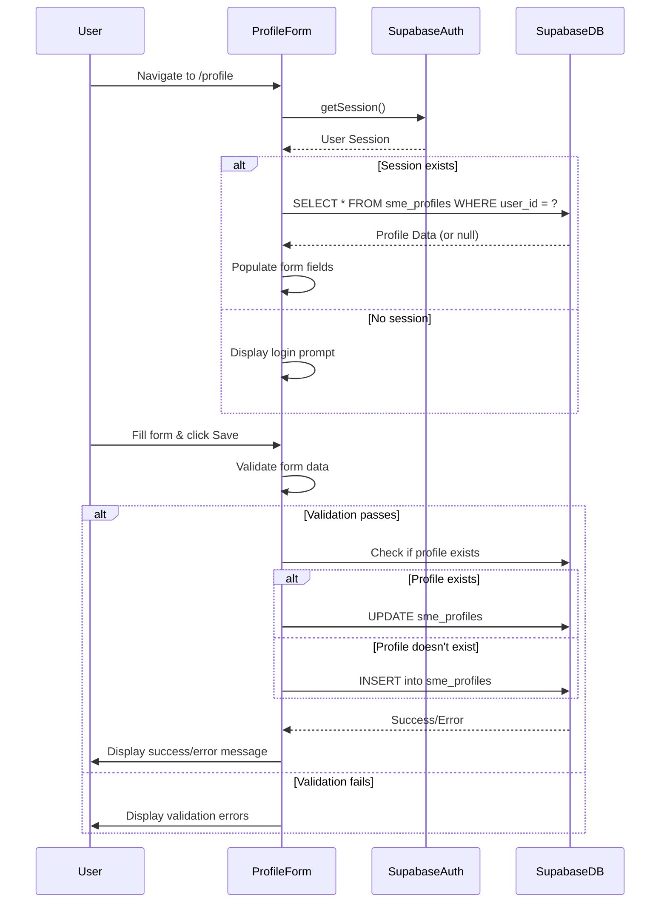
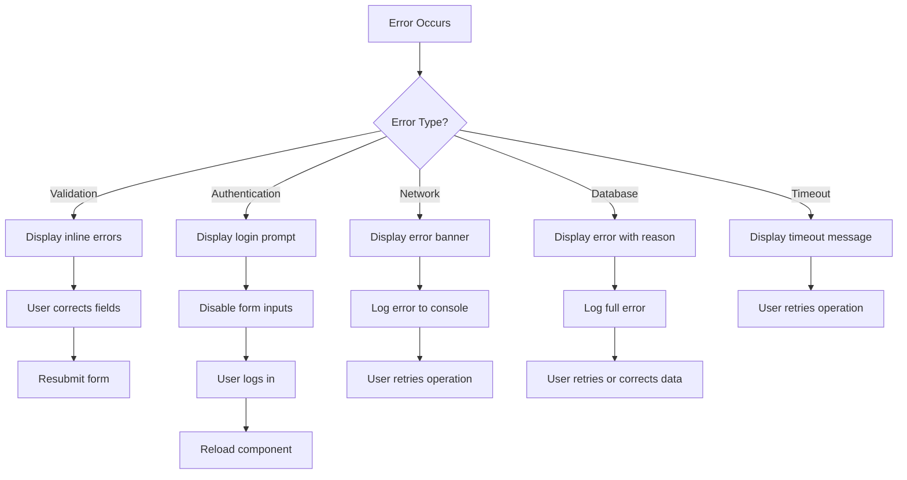

# Design Document: SME Profile Form

## Overview

The SME Profile Form is a React-based form component that enables SME vendors to create and manage their business profiles within the Event Discovery application. The component provides a comprehensive interface for collecting business information, contact details, and event participation preferences, with full integration to Supabase for authentication and data persistence.

### Key Features

- Comprehensive form with 9 input fields covering business details and preferences
- Real-time form validation with inline error messaging
- Automatic profile loading for authenticated users
- Upsert functionality (insert new profiles or update existing ones)
- Responsive design using Tailwind CSS
- Integration with Supabase Auth for user session management
- Integration with Supabase Database for profile persistence

### Technical Stack

- **Frontend Framework**: React 18.2.0
- **Styling**: Tailwind CSS 3.3.0
- **Backend**: Supabase (Auth + Database)
- **Client Library**: @supabase/supabase-js 2.0.0
- **Routing**: React Router DOM 6.0.0

## Architecture

### Component Architecture

The SME Profile Form follows a single-component architecture with clear separation of concerns:

```
Profile.js (Page Component)
├── Form State Management (React useState)
├── Session Management (useEffect + Supabase Auth)
├── Profile Data Loading (useEffect + Supabase Query)
├── Form Validation Logic
├── Form Submission Handler (Upsert Logic)
└── UI Rendering (Form Fields + Error Messages)
```

### Data Flow



### State Management

The component uses React's built-in `useState` hook for local state management:

- **formData**: Object containing all form field values
- **errors**: Object containing validation error messages keyed by field name
- **loading**: Boolean indicating data loading state
- **saving**: Boolean indicating save operation in progress
- **message**: Object containing success/error messages with type and text
- **session**: Object containing current user session from Supabase Auth
- **profileExists**: Boolean indicating whether a profile already exists for the user

## Components and Interfaces

### Profile Form Component

**File**: `src/pages/Profile.js`

**Responsibilities**:
- Render form UI with all input fields
- Manage form state and user input
- Validate form data before submission
- Load existing profile data on mount
- Handle profile creation and updates
- Display success and error messages
- Integrate with Supabase Auth and Database

**Props**: None (page-level component)

**State Structure**:

```javascript
{
  formData: {
    business_name: string,
    business_type: string,
    business_category: string,
    phone: string,
    email: string,
    website: string,
    can_sponsor: boolean,
    can_bazaar_vendor: boolean,
    bazaar_booth_budget_range: string
  },
  errors: {
    [fieldName]: string
  },
  loading: boolean,
  saving: boolean,
  message: {
    type: 'success' | 'error',
    text: string
  } | null,
  session: SupabaseSession | null,
  profileExists: boolean
}
```

### Supabase Client Interface

**File**: `src/supabaseClient.js`

**Exports**: `supabase` - Configured Supabase client instance

**Methods Used**:
- `supabase.auth.getSession()` - Retrieve current user session
- `supabase.from('sme_profiles').select()` - Query profile data
- `supabase.from('sme_profiles').insert()` - Create new profile
- `supabase.from('sme_profiles').update()` - Update existing profile

## Data Models

### SME Profile Data Model

**Table**: `sme_profiles`

**Schema**:

```typescript
interface SMEProfile {
  id: UUID;                          // Primary key (auto-generated)
  user_id: UUID;                     // Foreign key to auth.users (required)
  business_name: string;             // VARCHAR(255), required
  business_type: BusinessType;       // ENUM, required
  business_category: string | null;  // VARCHAR(100), optional
  phone: string | null;              // VARCHAR(20), optional
  email: string | null;              // VARCHAR(255), optional
  website: string | null;            // VARCHAR(2048), optional
  can_sponsor: boolean;              // Default: false
  can_bazaar_vendor: boolean;        // Default: false
  bazaar_booth_budget_range: BudgetRange | null; // VARCHAR, optional
  created_at: timestamp;             // Auto-generated
  updated_at: timestamp;             // Auto-updated
}

type BusinessType = 
  | 'food_beverage'
  | 'retail'
  | 'technology'
  | 'services'
  | 'health_wellness'
  | 'education'
  | 'entertainment'
  | 'fashion'
  | 'home_garden'
  | 'automotive'
  | 'finance'
  | 'real_estate'
  | 'other';

type BudgetRange = 'budget' | 'mid-range' | 'premium';
```

### Form Data Model

**Interface**: Internal component state

```typescript
interface FormData {
  business_name: string;
  business_type: string;
  business_category: string;
  phone: string;
  email: string;
  website: string;
  can_sponsor: boolean;
  can_bazaar_vendor: boolean;
  bazaar_booth_budget_range: string;
}
```

### Validation Rules

| Field | Required | Min Length | Max Length | Format |
|-------|----------|------------|------------|--------|
| business_name | Yes | 1 | 255 | Any text |
| business_type | Yes | - | - | Must be valid enum value |
| business_category | No | 0 | 100 | Any text |
| phone | No | 10 | 20 | Any text |
| email | No* | 5 | 254 | Must contain @ with chars before/after and dot after @ |
| website | No* | 0 | 2048 | Must start with http:// or https:// |
| can_sponsor | No | - | - | Boolean |
| can_bazaar_vendor | No | - | - | Boolean |
| bazaar_booth_budget_range | No | - | - | Must be valid value if provided |

*Required validation only if field is populated

## Correctness Properties

*A property is a characteristic or behavior that should hold true across all valid executions of a system—essentially, a formal statement about what the system should do. Properties serve as the bridge between human-readable specifications and machine-verifiable correctness guarantees.*

### Property 1: Form data round-trip preservation

*For any* valid profile data submitted through the form, when the data is saved to the database and then retrieved, the retrieved data SHALL match the originally submitted data for all fields.

**Validates: Requirements 2.1, 2.5, 2.6, 2.7, 3.4**

### Property 2: Validation rejection of invalid inputs

*For any* form submission where business_name is empty or business_type is not selected, the form validation SHALL reject the submission and display appropriate error messages without executing any database operations.

**Validates: Requirements 1.11, 1.12, 5.1, 5.2, 5.4, 5.5**

### Property 3: Email validation consistency

*For any* email string that contains an @ symbol with at least one character before it, at least one character after it, and at least one dot after the @ symbol, the email validation SHALL accept the input; for any email string that does not meet these criteria, the validation SHALL reject it.

**Validates: Requirements 1.13, 1.15, 5.3**

### Property 4: Website validation consistency

*For any* website string that begins with "http://" or "https://", the website validation SHALL accept the input; for any non-empty website string that does not begin with these prefixes, the validation SHALL reject it.

**Validates: Requirements 1.14, 1.15**

### Property 5: Field length constraint enforcement

*For any* form field with a maximum length constraint, when a user attempts to submit data exceeding that length, the validation SHALL reject the submission and display an error message indicating which field exceeds the maximum length.

**Validates: Requirements 2.3, 7.1, 7.3, 7.4, 7.5, 7.6, 7.13**

### Property 6: Upsert operation correctness

*For any* authenticated user with a valid session, when saving profile data, if a profile already exists for that user_id, the operation SHALL perform an UPDATE; if no profile exists, the operation SHALL perform an INSERT; in both cases, the final database state SHALL contain exactly one profile record for that user_id with the submitted data.

**Validates: Requirements 2.5, 2.6, 2.7**

### Property 7: Authentication requirement enforcement

*For any* form submission attempt, if the current user session is null, undefined, or expired, the form SHALL prevent the database operation and display an authentication error message.

**Validates: Requirements 2.4, 6.2, 6.3, 6.5, 6.6**

### Property 8: User isolation in profile operations

*For any* authenticated user performing a profile query or update operation, the operation SHALL only access or modify profile records where the user_id matches the current session's user_id, ensuring users cannot access or modify other users' profiles.

**Validates: Requirements 6.7, 6.8**

### Property 9: Optional field null handling

*For any* form submission where optional fields (business_category, phone, website, bazaar_booth_budget_range) are empty or not populated, the submitted data SHALL send NULL values for those fields to the database.

**Validates: Requirements 7.14**

### Property 10: Error message clearing on field modification

*For any* form field that has a validation error displayed, when the user modifies the content of that field, the error message for that specific field SHALL be cleared while preserving error messages for other fields.

**Validates: Requirements 5.7**

## Error Handling

### Error Categories

1. **Validation Errors**: Client-side validation failures
2. **Authentication Errors**: Missing or invalid user session
3. **Network Errors**: Failed API requests to Supabase
4. **Database Errors**: Supabase database operation failures
5. **Timeout Errors**: Operations exceeding time limits

### Error Handling Strategy

#### Validation Errors

- **Detection**: Triggered on form submission before database operations
- **Display**: Inline error messages below each invalid field
- **Recovery**: User corrects invalid fields and resubmits
- **Persistence**: Error messages cleared when user modifies the field

#### Authentication Errors

- **Detection**: Checked on component mount and before save operations
- **Display**: Prominent message prompting user to log in
- **Recovery**: User redirected to login flow (future implementation)
- **State**: Form inputs disabled when no session exists

#### Network Errors

- **Detection**: Caught from failed Supabase API calls
- **Display**: Error message banner at top of form
- **Recovery**: User can retry the operation
- **Logging**: Error details logged to console for debugging

#### Database Errors

- **Detection**: Caught from Supabase query/insert/update operations
- **Display**: Error message banner with failure reason
- **Recovery**: User can retry after correcting data or waiting
- **Logging**: Full error object logged to console

#### Timeout Errors

- **Detection**: Operations exceeding defined time limits (5s for queries, 30s for saves)
- **Display**: Timeout-specific error message
- **Recovery**: User can retry the operation
- **Implementation**: Using Promise.race with timeout promises

### Error Message Examples

```javascript
const errorMessages = {
  validation: {
    business_name_required: "Business name is required",
    business_name_too_long: "Business name must not exceed 255 characters",
    business_type_required: "Business type is required",
    email_invalid: "Email must contain @ with characters before and after, and at least one dot after @",
    website_invalid: "Website must start with http:// or https://",
    field_too_long: "{field} must not exceed {max} characters"
  },
  authentication: {
    no_session: "Please log in to create or edit your profile",
    session_expired: "Your session has expired. Please log in again",
    invalid_user_id: "Authentication is required to save your profile"
  },
  network: {
    connection_failed: "Network error occurred. Please check your connection and try again"
  },
  database: {
    save_failed: "Failed to save profile. Please try again",
    load_failed: "Failed to load profile data. Please refresh the page",
    query_error: "Database error occurred. Please try again later"
  },
  timeout: {
    session_timeout: "Session retrieval timed out. Please refresh the page",
    query_timeout: "Profile data loading timed out. Please try again",
    save_timeout: "Save operation timed out. Please try again"
  }
};
```

### Error Recovery Flows



## Testing Strategy

### Testing Approach

The SME Profile Form will use a dual testing approach combining property-based testing for universal behaviors and example-based unit tests for specific scenarios and edge cases.

### Property-Based Testing

**Library**: `fast-check` (JavaScript property-based testing library)

**Configuration**:
- Minimum 100 iterations per property test
- Each test tagged with feature name and property reference
- Tag format: `Feature: sme-profile-form, Property {number}: {property_text}`

**Property Test Coverage**:

1. **Property 1 Test**: Form data round-trip preservation
   - Generate random valid profile data
   - Submit to form, save to mock database, retrieve
   - Assert retrieved data matches original

2. **Property 2 Test**: Validation rejection of invalid inputs
   - Generate form data with missing business_name or business_type
   - Attempt submission
   - Assert validation errors displayed and no database call made

3. **Property 3 Test**: Email validation consistency
   - Generate random email strings (valid and invalid patterns)
   - Run validation
   - Assert valid emails accepted, invalid emails rejected

4. **Property 4 Test**: Website validation consistency
   - Generate random website strings (with and without http/https)
   - Run validation
   - Assert correct acceptance/rejection

5. **Property 5 Test**: Field length constraint enforcement
   - Generate strings exceeding max lengths for each field
   - Attempt submission
   - Assert validation errors for oversized fields

6. **Property 6 Test**: Upsert operation correctness
   - Generate random profile data
   - Test both insert (no existing profile) and update (existing profile) scenarios
   - Assert final database state contains exactly one record with correct data

7. **Property 7 Test**: Authentication requirement enforcement
   - Generate form submissions with null/undefined/expired sessions
   - Attempt save
   - Assert database operation prevented and error displayed

8. **Property 8 Test**: User isolation in profile operations
   - Generate multiple user sessions and profiles
   - Attempt cross-user access
   - Assert operations only affect current user's profile

9. **Property 9 Test**: Optional field null handling
   - Generate form data with various combinations of empty optional fields
   - Submit and check database payload
   - Assert empty fields sent as NULL

10. **Property 10 Test**: Error message clearing on field modification
    - Generate validation errors for multiple fields
    - Simulate user modifying one field
    - Assert only that field's error cleared

### Unit Testing

**Library**: Jest + React Testing Library (included with Create React App)

**Unit Test Coverage**:

1. **Component Rendering**
   - Form renders with all expected fields
   - Labels correctly associated with inputs
   - Save button present and styled

2. **Session Loading**
   - Component fetches session on mount
   - Displays login prompt when no session
   - Disables form when no session

3. **Profile Data Loading**
   - Fetches profile data for authenticated user
   - Populates form fields with existing data
   - Handles missing profile gracefully

4. **Specific Validation Examples**
   - Empty business name rejected
   - Invalid email formats rejected (no @, no dot, etc.)
   - Invalid website formats rejected (no protocol)
   - Valid inputs accepted

5. **Success Message Display**
   - Success message shown after successful save
   - Message persists for minimum 3 seconds
   - Message dismissible by user

6. **Error Scenarios**
   - Network error displays appropriate message
   - Database error displays appropriate message
   - Timeout error displays appropriate message

7. **Responsive Layout**
   - Form width constrained on desktop (≥768px)
   - Form full-width on mobile (<768px)

### Integration Testing

**Scope**: End-to-end flows with real Supabase instance (test environment)

**Integration Test Coverage**:

1. **Complete Profile Creation Flow**
   - User logs in
   - Navigates to profile page
   - Fills form with valid data
   - Submits successfully
   - Data persisted to database

2. **Profile Update Flow**
   - User with existing profile logs in
   - Profile data loaded into form
   - User modifies fields
   - Submits successfully
   - Database updated with new values

3. **Authentication Flow**
   - Unauthenticated user visits profile page
   - Login prompt displayed
   - Form disabled
   - After login, form enabled and functional

### Test Data Generators

For property-based testing, custom generators will be created:

```javascript
// Example generator structure
const profileDataGenerator = fc.record({
  business_name: fc.string({ minLength: 1, maxLength: 255 }),
  business_type: fc.constantFrom(
    'food_beverage', 'retail', 'technology', 'services',
    'health_wellness', 'education', 'entertainment', 'fashion',
    'home_garden', 'automotive', 'finance', 'real_estate', 'other'
  ),
  business_category: fc.option(fc.string({ maxLength: 100 })),
  phone: fc.option(fc.string({ minLength: 10, maxLength: 20 })),
  email: fc.emailAddress(),
  website: fc.option(fc.webUrl()),
  can_sponsor: fc.boolean(),
  can_bazaar_vendor: fc.boolean(),
  bazaar_booth_budget_range: fc.option(
    fc.constantFrom('budget', 'mid-range', 'premium')
  )
});
```

### Testing Timeline

1. **Phase 1**: Set up testing infrastructure (Jest, fast-check, React Testing Library)
2. **Phase 2**: Implement property-based tests for all 10 properties
3. **Phase 3**: Implement unit tests for specific scenarios
4. **Phase 4**: Implement integration tests with test Supabase instance
5. **Phase 5**: Continuous testing during development and CI/CD integration
